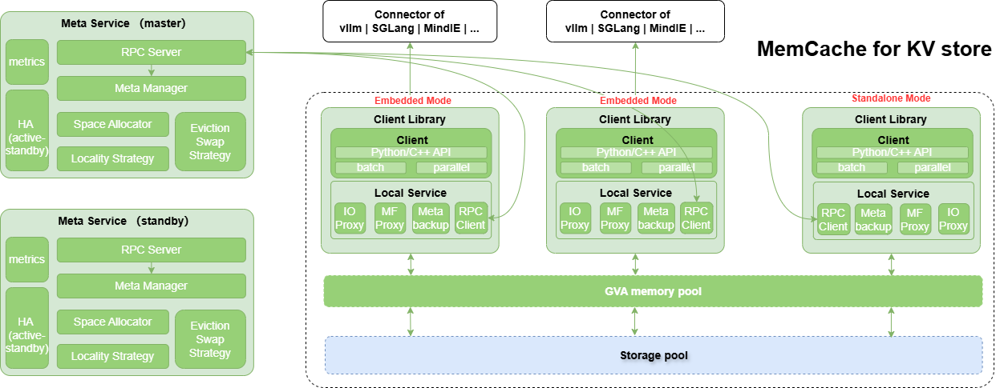

  
  

  <h2 align="center">
High-performance distributed key-value cache
  </h2>

 

## 🔄Latest News
- [2026/06] MemCache使能推理PrefixCache加速案例实践，请关注[wiki主页案例库](https://gitcode.com/Ascend/memcache/wiki/Home.md)获取最新案例
- [2025/12] MemCache已作为vllm-ascend backend使能大模型推理加速，详情查看vllm-ascend开源社区，[使用示例](https://github.com/vllm-project/vllm-ascend/blob/main/docs/source/user_guide/feature_guide/kv_pool.md#example-of-using-memcache-as-a-kv-pool-backend)

- [2025/11] MemCache项目于2025年11月开源，开源社区地址为：https://gitcode.com/Ascend/memcache

## 🔜 Roadmap&发布策略

MemCache roadmap详见： [**Roadmap**](https://gitcode.com/Ascend/memcache/wiki/Roadmap.md)
MemCache 分支发布策略：[**分支发布策略**](https://gitcode.com/Ascend/memcache/wiki/%E5%BC%80%E5%8F%91%E4%B8%8E%E5%8F%91%E5%B8%83%E8%8A%82%E5%A5%8F%E5%8E%9F%E5%88%99.md)

## 🎉概述

MemCache是针对LLM推理、GR推理场景设计的高性能分布式KVCache存储引擎，其主要特性包括：

- **基于对象操作的API**：支持批量和非批量的put/get/exist/remove操作，支持多层结构的KV Block读写接口。
- **多层缓存池**：支持HBM，DDR，SSD组成多级缓存池，多级之间通过淘汰和预取进行数据冷热交换。
- **高带宽低时延**：使用 [MemFabric](https://gitcode.com/Ascend/memfabric_hybrid)
  作为多级内存和异构网络传输的底座，在Ascend硬件上，基于device_rdma(A2)、device_sdma(A3)、host_rdma(A2/A3)、device_urma(A5)、device_uboe(A5)
  等路径提供OneCopy跨机跨介质数据直接访问能力，满足高带宽，低时延的读写性能述求。在鲲鹏硬件上，支持host_urma(K5)。支持host_shm实现同节点共享内存通信。
- **支持扩缩容**：支持LocalService动态加入和移除
- **HA能力**：在K8S集群中，MetaService支持多活能力，支持元数据恢复，提供尽力而为的HA能力。

  

## 🧩核心组件

MemCache包含LocalService和MetaService两大核心组件：

- **MetaService**：
  - 负责管理整个集群中内存池空间的分配和管理，处理LocalService的加入与退出。
  - MetaService作为独立进程运行，提供两种启动方式：python API启动；二进制启动，详见 [whl安装使用](./doc/install_whl.md) 和 [run安装使用](./doc/install_run.md)
  - MetaService支持两种部署形态：
  ***1、单点模式***：MetaService由单个进程组成，部署方式简单，但存在单点故障的问题。如果MetaService进程崩溃或无法访问，系统将无法继续提供服务，直至重新恢复为止。
  ***2、HA模式***：该模式基于K8S的的ClusterIP Service和Lease资源构建，部署较为复杂，该模式会部署多个MetaService进程实例，实现多活高可用。部署详见[怎么部署一个MemCache的HA集群](https://gitcode.com/Ascend/memcache/wiki/%E6%80%8E%E4%B9%88%E9%83%A8%E7%BD%B2%E4%B8%80%E4%B8%AAmemcache%E7%9A%84HA%E9%9B%86%E7%BE%A4.md)

- **LocalService**：负责承担如下功能：
  - **客户端**：作为客户端，以whl/so形式作为共享库被应用进程加载调用API
  - **内存提供者**：负责提供一段连续的内存区域作为内存池空间的一部分，其内存可以被其他LocalService实例基于地址直接访问。

## 🔥性能表现

MemCache核心能力是提供大容量内存池和高性能的H2D、D2H、**D2RH、RH2D**数据访问能力，由于MemCache以 [MemFabric](https://gitcode.com/Ascend/memfabric_hybrid) 作为池化底座，所以支持RH2D、D2RH等OneCopy跨机跨介质数据直接访问能力，下图为RH2D对比其他中转路径的对比示意图。

  

基于OneCopy跨机跨介质数据直接访问的能力，MemCache在A2/A3做了相关性能测试如下：
模拟构造DeepSeek-R1模型KV大小的block，单个block size为：61x128K + 61x16K = 8784KB ≈ 8.57MB，共122个离散地址。

- 使用2个昇腾A2节点(每节点8张卡)组成双机内存池进行读写测试性能如下：

  

- 使用2个昇腾A3节点(每节点8张卡16Die)组成双机内存池进行读写测试性能如下：

  

## 🚀快速入门

请访问以下文档获取简易教程。

- 安装使用：[whl安装和使用](./doc/install_whl.md)（适用于Python用户），[run编译、安装和使用](./doc/install_run.md)（适用于C++用户）
- [配置文件](doc/memcache_config.md)：涉及MetaService、LocalService公共配置
- [样例执行](./example/examples.md)：介绍如何端到端执行样例代码，包括C++和Python样例
- [DevContainer 远端开发](./doc/devcontainer_quickstart.md)：VS Code Remote-SSH + DevContainer 一站式开发环境搭建与全量示例运行指南

## 📑学习教程

- [c++接口](doc/memcache_c++_api.md)：C++接口介绍以及C++接口对应的API列表
- [python接口](doc/memcache_python_api.md)：python接口介绍以及python接口对应的API列表

## 📦软件硬件配套说明

- MemCache软件依赖 [MemFabric](https://gitcode.com/Ascend/memfabric_hybrid)，相关配套与MemFabric相同

## 📌FAQ

常见问题请参考：[FAQ](https://gitcode.com/Ascend/memcache/wiki/FAQ.md)

## 📝相关信息

- [安全声明](./doc/SECURITYNOTE.md)

- [许可证](./LICENSE)
