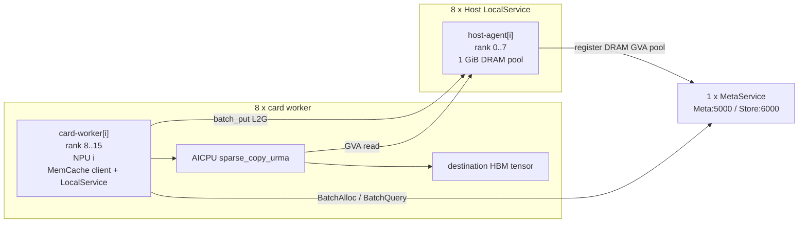

# MemCache + MemFabric 本地 DRAM 到 HBM 最小功能验证

## 1. 目的

这个 example 只验证下面三件事能否通过真实接口串起来：

1. NPU 进程调用 MemCache `batch_put_from_layers`，MetaService 把对象分配到指定 Host rank 的 DRAM GVA，并由 MemFabric 完成 L2G 写入。
2. NPU 进程调用 MemCache `batch_get_key_info`，拿到对象大小、所在 rank、介质类型和 GVA。
3. NPU 进程在 GVA 上增加一个合法的随机偏移，再把源地址、目标 HBM 地址和长度传给 MemFabric `sparse_copy_urma`；AICPU 将 Host DRAM 中的片段复制到 HBM，最后比较数据。

不启动 vLLM，不模拟 vLLM 调度，也不计算 miss。每个 key 对应一个完整对象，consumer 只增加一层简单的随机 GVA offset，用于验证 `batch_get_key_info` 返回的 GVA 可以直接参与地址运算并被 `sparse_copy_urma` 使用。

验证基线：

| 仓库 | 分支/提交 |
|---|---|
| MemCache | `feat/aicpu-urma-design` / `481c3a47` |
| MemFabric Hybrid | `feat/aicpu-urma-design-local-dram` / `c42438e5` |
| vLLM Ascend | `main` / `3a97fe2ad`，只用于确认 KV buffer 的接口形态 |
| vLLM | `main` / `68b4a1d58`，example 不依赖 |

## 2. 最简验证链路

每个 card worker 在一张 NPU 上执行完整的 producer + consumer 流程：

```text
构造 NPU tensors
    -> MemCache batch_put_from_layers(L2G, preferredHostRank)
    -> MemCache batch_get_key_info(keys)
    -> 取每个 KeyInfo 的第一个 DRAM GVA
    -> 为每个 key 生成合法随机 offset
    -> 构造 NPU int64 tensors [srcGva + offset] [dstHbmVa] [length]
    -> mf_acc_offload.sparse_copy_urma(...)
    -> 比较目标 HBM tensor 与原始对象对应切片
```

为避免引入 layout 代码，每个 key 的远端对象按下面方式构造：

```text
key-0 = layer-0[4 KiB] + layer-1[4 KiB] + layer-2[4 KiB] + layer-3[4 KiB]
object size = 16 KiB
```

`batch_put_from_layers` 将四个 layer buffer 写入同一个连续远端对象。consumer 将四层拼成逻辑上的 16 KiB 对象，为每个 key 生成 `1 <= offset <= objectBytes-copyBytes` 的随机偏移，复制固定 `copyBytes=1024` 字节。随机数使用固定 seed，便于复现；这不是 vLLM 的 miss/跨 block 逻辑。

vLLM Ascend 当前也是以 `keys + 每个 key 的 buffer 地址列表 + size 列表` 调用 MemCache：

- `vllm_ascend/distributed/kv_transfer/kv_pool/ascend_store/kv_transfer.py:381-429` 生成 key、地址和 size。
- `vllm_ascend/distributed/kv_transfer/kv_pool/ascend_store/backend/memcache_backend.py:145-160` 调用 `batch_put_from_layers(..., COPY_L2G)`。
- `vllm_ascend/distributed/kv_transfer/kv_pool/ascend_store/config_data.py:326-377` 计算 block buffer 地址。

example 只复用这种输入形态，不复用 vLLM scheduler、block manager 或 connector。

## 3. 当前代码已经具备的接口

| 功能 | 代码位置 | example 用法 |
|---|---|---|
| Python batch put | MemCache `src/memcache/csrc/python_wrapper/pymmc.cpp:846-866` | `store.batch_put_from_layers(...)` |
| 指定 Host rank | MemCache `src/memcache/include/cpp/mmcache.h:106-110` | `ReplicateConfig.preferredLocalServiceIDs=[hostRank]` |
| Meta 分配和写入 | MemCache `src/memcache/csrc/client/mmc_client_default.cpp:290-344,1055-1105` | 由 batch put 内部执行 |
| Host pool 注册 Meta | MemCache `src/memcache/csrc/local_service/mmc_local_service_default.cpp:213-231` | Host agent 启动 LocalService |
| Python key info | MemCache `src/memcache/csrc/python_wrapper/pymmc.cpp:28-34,707-714` | `size()`、`loc_list()`、`type_list()`、`gva_list()` |
| HOST_DEVICE_URMA 枚举 | MemFabric `src/hybm/include/hybm_def.h:68-92` | BM data-op type |
| route 发布 | MemFabric `src/hybm/csrc/transport/device/urma/device_urma_transport_manager.cpp:1287-1495` | BM join/prepare 时完成 |
| Python sparse copy | MemFabric `src/smem/python/memfabric_hybrid/memfabric_hybrid/mf_acc_offload.py:44-47` | `sparse_copy_urma(srcTensor,dstTensor,lenTensor,count,device)` |
| AICPU GVA 查路由 | MemFabric `src/acc_offload/csrc/operators/aicpu/hybm_batch_copy.cc:202-279` | example 无需传 EID、rank 或 memory key |
| AICPU 完成复制 | MemFabric `src/acc_offload/csrc/operators/aicpu/hybm_batch_copy.cc:300-378` | Python API 返回后比较 tensor |

`KeyInfo` 对这个 example 已经够用：只选择一个 replica，以 `KeyInfo.size()` 校验对象边界，再使用 `gva_list()[0] + offset` 作为 sparse-copy 源地址。无需扩展 KeyInfo。

## 4. 必须改动的点

下面只列让 8 Host + 8 NPU 的最简链路跑起来所必需的改动。建议按编号逐条评审。

### M1. MemCache 使用目标 MemFabric 版本

**改动：**将 MemCache 构建时使用的 MemFabric headers/library 对齐到 `c42438e5`。当前 MemCache gitlink 是 `8a8699dc`。

**必要性：**`HOST_DEVICE_URMA`、本地 Host DRAM validation route 和 `sparse_copy_urma` 来自目标 MemFabric 分支。MemCache 如果继续使用旧接口，无法创建同一种 BM world。

**最小做法：**先在 example 构建环境中明确指定 `c42438e5` 产出的 include/lib；确认接口后再决定是否更新 gitlink。不要同时修改 MemFabric 其他逻辑。

### M2. MemCache 接受 `host_device_urma`

**改动位置：**

1. `src/memcache/csrc/under_api/mf_smem/smem_bm_def.h:55-64`：补充与 MemFabric 公共 SMEM API 一致的 `SMEMB_DATA_OP_HOST_DEVICE_URMA = 1U << 8`。注意 `1U << 10` 是 MemFabric 内部 `HYBM_DOP_TYPE_HOST_DEVICE_URMA` 的编码，不可直接写入 SMEM 公共枚举。
2. `src/memcache/csrc/config/mmc_configuration.h:51-52`：把 `host_device_urma` 加入 protocol 可选值。
3. `src/memcache/csrc/common/mmc_smem_bm_helper.h:23-50`：把字符串映射到 `SMEMB_DATA_OP_HOST_DEVICE_URMA`。

**必要性：**MemCache LocalService 负责创建 BM 并向 MetaService 注册 DRAM/HBM pool。若 MemCache 不认识该协议，`MmcBmProxy::InternalCreateBm` 会直接返回错误，Host pool 和 card route 都不会建立。

### M3. MemFabric validation Host role 支持多个 Host rank

**改动位置：**MemFabric `src/hybm/csrc/common/local_dram_validation_role.h:30-56`。

**改动：**保留 `MF_LOCAL_DRAM_VALIDATION_ROLE=host` 和 `MF_HOST_URMA_EID` 判断，去掉 Host role 必须 `rankId==0` 的限制。

**必要性：**当前 1+1 example 固定 Host rank 0。8+8 单 world 中 Host ranks 是 0～7；不去掉该限制，rank 1～7 的 Host manager 无法初始化。

### M4. 新增最小 example driver

**改动：**只新增第 12 节列出的 example 文件。

**必要性：**仓库当前没有独立 Host LocalService 可执行程序，也没有把 `batch_get_key_info` 结果直接传给 `sparse_copy_urma` 的示例。

### 明确不改的部分

| 部分 | 原因 |
|---|---|
| MetaService allocator、key metadata | 当前 batch put/query 已可满足对象内片段验证 |
| MemCache `KeyInfo` | `size + loc + type + gva` 足够构造带随机偏移的 sparse copy |
| MemCache batch put/client/server | 直接使用现有真实链路 |
| MemFabric route table和 AICPU kernel | 当前实现已支持按 GVA 查 route 和复制 |
| CANN/HCOMM | example 直接使用 MemFabric 当前调用链 |
| vLLM/vLLM Ascend | example 用独立 card worker，不接入 connector |
| vLLM miss、跨 block 逻辑 | 不属于接口打通所需内容；只保留随机 GVA offset |
| 多 replica、单请求跨多个 Host | 第一版不验证 |

因此，库代码的必改范围只有 M1～M3；M4 是 example 自身。

## 5. 8 Host + 8 NPU 进程部署

### 5.1 进程部署图



总进程：

- 1 个 MetaService；
- 8 个 `host_agent`，每个创建一个 Host DRAM pool；
- 8 个 `card_worker`，每个绑定一张 NPU，并在同一进程中执行 put、key-info、sparse-copy、compare。

不额外启动 vLLM 进程，也不启动独立 card-side MemCache daemon。MemCache LocalService 和 client 由每个 `card_worker` 内的 `DistributedObjectStore.init()` 启动。

### 5.2 固定参数

第一版统一使用以下值，减少配置分支：

| 参数 | 值 |
|---|---|
| `WORLD_SIZE` | `16` |
| `CREATE_ID` | `0` |
| `DATA_OP_TYPE` | `host_device_urma` |
| `META_URL` | `tcp://127.0.0.1:5000` |
| `STORE_URL` | `tcp://127.0.0.1:6000` |
| `METRICS_URL` | `http://127.0.0.1:8000` |
| `HCOM_URL` | `tcp://127.0.0.1:7000` |
| 每个 Host local DRAM | `1GB` |
| 每个 Host local HBM | `0` |
| 每个 card local DRAM | `0` |
| 每个 card local HBM | `1GB` |
| 所有进程 max DRAM | `1GB` |
| 所有进程 max HBM | `1GB` |
| `KEY_COUNT` | `4` |
| `LAYER_COUNT` | `4` |
| `LAYER_BYTES` | `4096` |
| 每个 key object size | `16384` bytes |
| `COPY_BYTES` | `1024` |
| `RANDOM_SEED` | `20260814 + slot` |
| replica | `1` |

example 固定填写已经对齐的 1 GiB pool，不需要为了本 example 修改 MemCache 的容量对齐逻辑；实际只使用很小的一段空间。

### 5.3 rank、设备和 EID 表

Host 进程先启动并取得 ranks 0～7，card 进程随后取得 ranks 8～15。每个进程启动后打印 MemFabric 实际 rank；输出必须与下表一致。

| slot | MF rank | 进程 | physical NPU | runtime device | EID 环境变量 | put 目标 Host rank |
|---:|---:|---|---:|---:|---|---:|
| 0 | 0 | host-agent-0 | - | `0`（validation 参数） | `MF_HOST_URMA_EID=${HOST_EID_0}` | - |
| 1 | 1 | host-agent-1 | - | `0`（validation 参数） | `MF_HOST_URMA_EID=${HOST_EID_1}` | - |
| 2 | 2 | host-agent-2 | - | `0`（validation 参数） | `MF_HOST_URMA_EID=${HOST_EID_2}` | - |
| 3 | 3 | host-agent-3 | - | `0`（validation 参数） | `MF_HOST_URMA_EID=${HOST_EID_3}` | - |
| 4 | 4 | host-agent-4 | - | `0`（validation 参数） | `MF_HOST_URMA_EID=${HOST_EID_4}` | - |
| 5 | 5 | host-agent-5 | - | `0`（validation 参数） | `MF_HOST_URMA_EID=${HOST_EID_5}` | - |
| 6 | 6 | host-agent-6 | - | `0`（validation 参数） | `MF_HOST_URMA_EID=${HOST_EID_6}` | - |
| 7 | 7 | host-agent-7 | - | `0`（validation 参数） | `MF_HOST_URMA_EID=${HOST_EID_7}` | - |
| 0 | 8 | card-worker-0 | 0 | 0 | `USE_LOCAL_EID=${DEVICE_EID_0}` | 0 |
| 1 | 9 | card-worker-1 | 1 | 0 | `USE_LOCAL_EID=${DEVICE_EID_1}` | 1 |
| 2 | 10 | card-worker-2 | 2 | 0 | `USE_LOCAL_EID=${DEVICE_EID_2}` | 2 |
| 3 | 11 | card-worker-3 | 3 | 0 | `USE_LOCAL_EID=${DEVICE_EID_3}` | 3 |
| 4 | 12 | card-worker-4 | 4 | 0 | `USE_LOCAL_EID=${DEVICE_EID_4}` | 4 |
| 5 | 13 | card-worker-5 | 5 | 0 | `USE_LOCAL_EID=${DEVICE_EID_5}` | 5 |
| 6 | 14 | card-worker-6 | 6 | 0 | `USE_LOCAL_EID=${DEVICE_EID_6}` | 6 |
| 7 | 15 | card-worker-7 | 7 | 0 | `USE_LOCAL_EID=${DEVICE_EID_7}` | 7 |

每个 card worker 只暴露一张物理卡，所以其进程内 runtime device 都是 0：

```bash
ASCEND_RT_VISIBLE_DEVICES=${slot}
```

`HOST_EID_0..7` 和 `DEVICE_EID_0..7` 是运行机器上的 32 位十六进制 EID，需要在执行 example 前填入 `run_e2e.env`。

## 6. 配置文件

### 6.1 MetaService：`mmc-meta.conf`

```properties
ock.mmc.meta_service_url = tcp://127.0.0.1:5000
ock.mmc.meta_service.config_store_url = tcp://127.0.0.1:6000
ock.mmc.meta_service.metrics_url = http://127.0.0.1:8000
ock.mmc.log_level = info
ock.mmc.log_output_target = screen
```

### 6.2 Host LocalService 参数模板

`host_agent` 直接构造 `mmc_local_service_config_t`：

```text
discoveryURL    = tcp://127.0.0.1:5000
deviceId        = 0
worldSize       = 16
bmIpPort        = tcp://127.0.0.1:6000
bmHcomUrl       = tcp://127.0.0.1:7000
backendId       = host-${slot}
createId        = 0
dataOpType      = host_device_urma
localDRAMSize   = 1073741824
localMaxDRAMSize= 1073741824
localHBMSize    = 0
localMaxHBMSize = 1073741824
storageEnabled  = false
```

每个 Host 进程额外设置：

```bash
export MF_LOCAL_DRAM_VALIDATION_ROLE=host
host_eid_var="HOST_EID_${slot}"
export MF_HOST_URMA_EID="${!host_eid_var}"
export MF_HYBM_RDMA_SWAP_SPACE_SIZE=0
```

### 6.3 Card LocalService：`card-${slot}.conf`

8 份配置只有 `backend_id` 不同：

```properties
ock.mmc.meta_service_url = tcp://127.0.0.1:5000
ock.mmc.local_service.config_store_url = tcp://127.0.0.1:6000
ock.mmc.local_service.world_size = 16
ock.mmc.local_service.protocol = host_device_urma
ock.mmc.local_service.hcom_url = tcp://127.0.0.1:7000
ock.mmc.local_service.backend_id = card-${slot}
ock.mmc.local_service.dram.size = 0
ock.mmc.local_service.hbm.size = 1GB
ock.mmc.local_service.max.dram.size = 1GB
ock.mmc.local_service.max.hbm.size = 1GB
ock.mmc.log_level = info
```

每个 card worker 额外设置：

```bash
export ASCEND_RT_VISIBLE_DEVICES=${slot}
device_eid_var="DEVICE_EID_${slot}"
export USE_LOCAL_EID="${!device_eid_var}"
export MMC_LOCAL_CONFIG_PATH=${RUN_DIR}/card-${slot}.conf
```

## 7. 8+8 example 使用说明

### 7.1 构建

MemCache 继续使用仓库统一构建命令：

```bash
bash script/build_and_pack_run.sh --build_mode DEBUG --incremental
```

MemFabric 必须使用 `c42438e5`，并打开本地 DRAM validation：

```text
BUILD_LOCAL_DRAM_VALIDATION=ON
XPU_TYPE=NPU
```

具体 MemFabric 构建命令沿用其仓库构建说明；example 只需要最终能加载 BM library、`mf_acc_offload` Python module 和 `HybmBatchCopy` kernel。

### 7.2 准备 EID

创建 `example/e2e_local_dram_memcache/run_e2e.env`：

```bash
HOST_EID_0=<32 hex chars>
HOST_EID_1=<32 hex chars>
HOST_EID_2=<32 hex chars>
HOST_EID_3=<32 hex chars>
HOST_EID_4=<32 hex chars>
HOST_EID_5=<32 hex chars>
HOST_EID_6=<32 hex chars>
HOST_EID_7=<32 hex chars>

DEVICE_EID_0=<32 hex chars>
DEVICE_EID_1=<32 hex chars>
DEVICE_EID_2=<32 hex chars>
DEVICE_EID_3=<32 hex chars>
DEVICE_EID_4=<32 hex chars>
DEVICE_EID_5=<32 hex chars>
DEVICE_EID_6=<32 hex chars>
DEVICE_EID_7=<32 hex chars>
```

### 7.3 启动

推荐由 `run_e2e.sh --count 8` 完成以下动作：

1. 生成 1 份 Meta 配置和 8 份 card 配置。
2. 启动 MetaService：

   ```bash
   MMC_META_CONFIG_PATH=${RUN_DIR}/mmc-meta.conf \
     ${MMC_INSTALL}/bin/mmc_meta_service
   ```

3. 依次拉起 8 个 Host 子进程；子进程进入 BM join 后保持运行：

   ```bash
   MF_LOCAL_DRAM_VALIDATION_ROLE=host \
   MF_HOST_URMA_EID=${HOST_EID_i} \
   MF_HYBM_RDMA_SWAP_SPACE_SIZE=0 \
     ${EXAMPLE_BIN}/host_agent --slot ${i} --world-size 16 \
       --meta-url tcp://127.0.0.1:5000 \
       --store-url tcp://127.0.0.1:6000 \
       --hcom-url tcp://127.0.0.1:7000 \
       --dram-size 1GB --max-dram-size 1GB --max-hbm-size 1GB
   ```

4. 拉起 8 个 card worker：

   ```bash
   ASCEND_RT_VISIBLE_DEVICES=${i} \
   USE_LOCAL_EID=${DEVICE_EID_i} \
   MMC_LOCAL_CONFIG_PATH=${RUN_DIR}/card-${i}.conf \
     python example/e2e_local_dram_memcache/card_worker.py \
       --slot ${i} --device-id 0 --preferred-host-rank ${i} \
       --key-count 4 --layer-count 4 --layer-bytes 4096 \
       --copy-bytes 1024 --random-seed 20260814
   ```

5. 检查所有进程打印的 rank：Host 为 0～7，card 为 8～15。
6. 等待 8 个 card worker 输出 `PASS`。
7. card worker 结束后停止 8 个 Host 进程和 MetaService。

### 7.4 每个 card worker 的预期输出

```text
slot=0 expected_rank=8 preferred_host_rank=0
batch_put results=[0, 0, 0, 0]
key_info key_count=4 all_media=DRAM all_rank=0 all_size=16384
sparse_offsets=[...] copy_bytes=1024
sparse_copy list_num=4 result=0
compare key_count=4 result=PASS
slot=0 PASS
```

slot 1～7 的输出相同，rank 和 preferred Host rank 按表变化。

## 12. Example 文件与最小伪代码

建议只新增四个文件：

| 文件 | 代码职责 |
|---|---|
| `example/e2e_local_dram_memcache/README.md` | 第 5～7 节的使用说明 |
| `example/e2e_local_dram_memcache/host_agent.cpp` | 构造 `mmc_local_service_config_t`，调用 `mmcs_local_service_start` 并保持进程运行 |
| `example/e2e_local_dram_memcache/card_worker.py` | 同一 NPU 进程内执行 put、key-info、sparse-copy、compare |
| `example/e2e_local_dram_memcache/run_e2e.sh` | 根据 `--count 1/2/8` 生成配置并启动对应规模进程 |

不新增 mock server、配置框架、manifest schema 或 vLLM connector。

### 12.1 `host_agent.cpp`

```cpp
int main(int argc, char **argv)
{
    mmc_local_service_config_t config{};
    // 从少量 CLI 参数填 discoveryURL、worldSize、store/hcom URL、pool size。
    config.deviceId = 0;
    config.createId = 0;
    Copy(config.dataOpType, "host_device_urma");
    auto handle = mmcs_local_service_start(&config);
    CHECK(handle != nullptr);
    PrintReady();
    WaitForStopSignal();
    mmcs_local_service_stop(handle);
}
```

这个进程不创建 MemCache client，只提供 DRAM pool并向 MetaService 注册。

### 12.2 `card_worker.py`

```python
import random


def make_layer(slot: int, key_index: int, layer_index: int, size: int):
    value = (slot * 32 + key_index * 4 + layer_index) % 256
    return torch.full((size,), value, dtype=torch.uint8, device="npu")


store = DistributedObjectStore()
assert store.init(device_id) == 0

keys = [f"e2e-slot-{slot}-key-{i}" for i in range(key_count)]
src_layers = [
    [make_layer(slot, key_i, layer_i, layer_bytes) for layer_i in range(layer_count)]
    for key_i in range(key_count)
]
torch.npu.synchronize()

replica = ReplicateConfig()
replica.replicaNum = 1
replica.preferredLocalServiceIDs = [preferred_host_rank]

put_result = store.batch_put_from_layers(
    keys,
    [[layer.data_ptr() for layer in layers] for layers in src_layers],
    [[layer_bytes] * layer_count for _ in keys],
    L2G,
    replica,
)
assert put_result == [0] * key_count

infos = store.batch_get_key_info(keys)
object_bytes = layer_count * layer_bytes
assert 0 < copy_bytes < object_bytes
rng = random.Random(random_seed + slot)
src_addresses = []
offsets = []
MEDIA_DRAM = 1
for info in infos:
    assert info.size() == object_bytes
    assert info.loc_list() == [preferred_host_rank]
    assert info.type_list() == [MEDIA_DRAM]
    offset = rng.randint(1, object_bytes - copy_bytes)
    offsets.append(offset)
    src_addresses.append(info.gva_list()[0] + offset)

dst = [torch.empty(copy_bytes, dtype=torch.uint8, device="npu") for _ in keys]
src_array = torch.tensor(src_addresses, dtype=torch.int64, device="npu")
dst_array = torch.tensor([tensor.data_ptr() for tensor in dst], dtype=torch.int64, device="npu")
len_array = torch.full((key_count,), copy_bytes, dtype=torch.int64, device="npu")
device = torch.device(f"npu:{device_id}")

ret = mf_acc_offload.sparse_copy_urma(
    src_array,
    dst_array,
    len_array,
    key_count,
    device,
)
assert ret == 0
torch.npu.synchronize()

for key_i, tensor in enumerate(dst):
    full_object = torch.cat(src_layers[key_i])
    offset = offsets[key_i]
    expected = full_object[offset : offset + copy_bytes]
    assert torch.equal(tensor, expected)

store.remove_batch(keys)
store.close()
print(f"slot={slot} PASS")
```

实现时直接使用 Python binding 的真实方法名：`KeyInfo.size()`、`loc_list()`、`type_list()` 和 `gva_list()`（MemCache `pymmc.cpp:28-34`）。

### 12.3 `run_e2e.sh`

脚本只做：

1. `source run_e2e.env`；
2. 读取 `--count`，计算 `worldSize=2*count`，创建 `${RUN_DIR}` 并生成配置；
3. 启动 MetaService；
4. 根据 `--count` 启动 1、2 或 8 个 Host agents；
5. 启动相同数量的 card workers；
6. `wait` 所有 card workers并汇总 PASS 数；
7. 停止 Host agents 和 MetaService。

## 13. 功能验证计划

### 13.1 第一阶段：1 Host + 1 NPU

先用同一套 driver 运行：

```text
WORLD_SIZE=2
Host rank=0
card rank=1
preferredHostRank=0
```

验证点：

- Host LocalService 在 MetaService 中注册一个 DRAM GVA pool；
- `batch_put_from_layers` 四个 key 全部返回 0；
- `batch_get_key_info` 返回 DRAM、Host rank 0、16 KiB 和非零 GVA；
- 每个 key 在 GVA 上增加一个固定 seed 生成的非零随机偏移，且 `offset + 1024 <= 16384`；
- `sparse_copy_urma` 返回 0；
- 四个目标 HBM tensors 与 producer 对象的对应 1024-byte 切片相同。

### 13.2 第二阶段：2 Host + 2 NPU

环境允许两张 NPU 时，先运行：

```bash
bash example/e2e_local_dram_memcache/run_e2e.sh --count 2
```

对应参数：

```text
WORLD_SIZE=4
Host ranks=0,1
card ranks=2,3
card slot 0 -> preferredHostRank 0
card slot 1 -> preferredHostRank 1
physical NPU=0,1；每个进程 runtime device=0
```

| 检查项 | 预期结果 |
|---|---|
| MF world 成员 | 4 |
| Host pools | rank 0、1 各注册 1 GiB DRAM |
| card workers | rank 2、3 分别绑定 physical NPU 0、1 |
| batch put | 两个 card 各 4 个返回值均为 0 |
| key info | slot 0 的 key 位于 Host rank 0；slot 1 位于 Host rank 1 |
| GVA offset | 每个 key 都使用非零随机 offset，复制区间位于 16 KiB 对象内 |
| sparse copy | 两个 card 均以 `listNum=4` 返回 0 |
| HBM compare | 两个 card 的 4 个 1024-byte 切片全部相同 |
| 最终结果 | `slot=0 PASS`、`slot=1 PASS` |

### 13.3 第三阶段：8 Host + 8 NPU

按第 5～7 节运行 8+8：

| 检查项 | 预期结果 |
|---|---|
| MF world 成员 | 16 |
| Host ranks | 0～7，各 1 GiB DRAM、0 HBM |
| card ranks | 8～15，各 0 DRAM、1 GiB HBM |
| 每个 card 的 preferred Host | `card slot i -> Host rank i` |
| 每个 card batch put | 4 个返回值均为 0 |
| 每个 card key info | 4 个对象均在 Host rank i 的 DRAM，size=16 KiB |
| 每个 card GVA offset | 4 个非零随机 offset，复制区间均位于对象内 |
| 每个 card sparse copy | `listNum=4`，返回 0 |
| HBM compare | 每 card 4 个 1024-byte 切片全部相同 |
| 最终结果 | 8 个 `slot=i PASS` |

### 13.4 通过标准

满足下面三个条件即认为目标接口打通：

1. 8 个 card worker 都能通过真实 MemCache batch put 把数据写入各自 Host DRAM pool。
2. 8 个 card worker 都能通过真实 `batch_get_key_info` 获得对应 GVA，并用 `GVA + 随机合法 offset` 作为源地址。
3. 8 个 card worker 都能通过真实 AICPU `sparse_copy_urma` 把对象片段复制回 HBM并通过逐字节比较。

完成以上验证后，再决定是否把相同的三个调用接入 vLLM。这个 example 本身不继续扩展 vLLM 逻辑。
