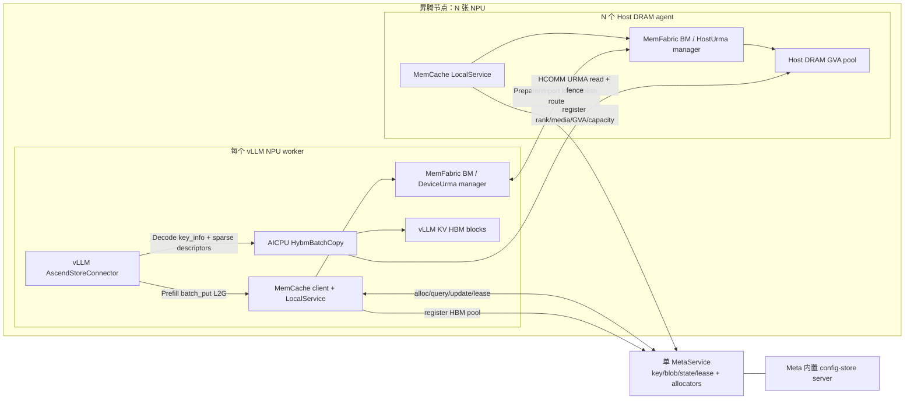
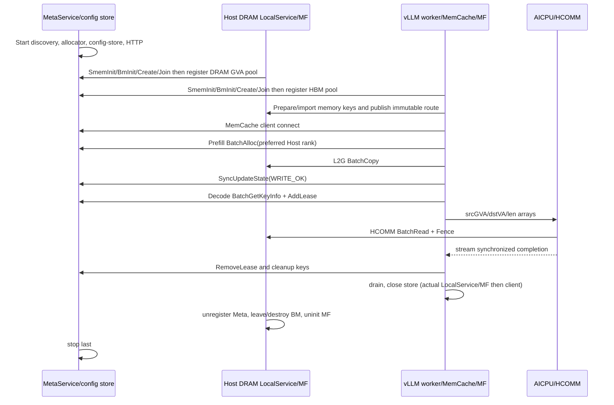

# MemCache 本地 DRAM 到 HBM 端到端部署与验证设计

> 状态：设计草案，等待评审；本文不包含实现。
>
> 取证基线：MemCache `481c3a47`、MemFabric Hybrid `c42438e5`、vLLM Ascend `3a97fe2ad`、vLLM `68b4a1d58`。路径和行号均相对相应仓库的该基线。

## Overview

### 目标

本文设计一条可分阶段验证的真实数据链路：vLLM 的 Prefill worker 将 KV block 通过 MemCache `batch_put` 写入由本机 Host DRAM 进程模拟的远端鲲鹏 DRAM；Decode worker 在调度命中后调用 `batch_get_key_info`，根据本地缺失 token/block 和块内偏移生成稀疏复制描述符，再调用 MemFabric AICPU 的真实 `sparse_copy_urma` 将远端 GVA 数据直接写入 Decode HBM，并回读校验。

本文只设计，不修改源码、测试、配置和构建。所有命令中的 `${...}` 都是必须由运行清单显式提供的变量；无法从源码确认的 CANN/HCOMM、网卡、EID 和容量值标为“待确认/待实机验证”。

### 状态术语

| 状态 | 含义 |
|---|---|
| 已实现 | 基线源码中存在可执行调用链和主要错误处理 |
| 仅接口/声明 | 存在 API、ABI 或绑定，但未接入目标调用链，或实现被注释/编译开关隔离 |
| 设计设想 | 本文建议的未来行为，当前源码没有该保证 |
| 完全缺失 | 基线中未找到目标接口或集成点 |

### 结论先行

1. **现有 vLLM Ascend 已有 MemCache backend，但不是目标 Decode 数据面。** `MemcacheBackend.put()` 已调用 `batch_put_from_layers`，`get()` 仍调用 `batch_get_into_layers(..., COPY_G2L)`；没有 `batch_get_key_info` 或 `sparse_copy_urma` 接入（`vllm_ascend/distributed/kv_transfer/kv_pool/ascend_store/backend/memcache_backend.py:96-149`）。
2. **“8 卡”不等于 8 个独立 MemCache daemon。** `DistributedObjectStore.init()` 会在每个 vLLM worker 进程中启动 MemCache LocalService、MemFabric BM 和 client（MemCache `src/memcache/csrc/mmc.cpp:237-282`）。单个 `vllm serve --tensor-parallel-size 8` 通常产生 8 个 NPU worker 内嵌实例；如果 Prefill、Decode 各自启动 8 个 colocated worker，则是 16 个卡侧实例，world 规模也必须相应增加。
3. **建议第一条 8 卡 E2E 使用每卡一个 `kv_both` worker。** 它对应 8 个 NPU worker + 8 个 Host DRAM LocalService 进程 + 1 个 MetaService，MemFabric `worldSize=16`。真实 P/D 分进程放在后续阶段，避免首次验证同时引入 32-rank 拓扑。
4. **MetaService 不是每卡一份。** 最小拓扑使用单实例；它同时启动 config-store server，维护全局 key→blob 元数据和按 rank/media 的 GVA allocator（MemCache `src/memcache/csrc/meta_service/mmc_meta_service.cpp:44-108`、`mmc_meta_manager.cpp:731-870`）。生产可评估主备，但本地 E2E 不启用 HA。
5. **目标 2+2/8+8 尚不能按当前基线直接运行。** P0 缺口包括：MemCache 不识别 `host_device_urma`；MemCache 绑定的 MemFabric 子模块还是 `8a8699dc` 而非取证分支 `c42438e5`；MemFabric 本地 validation Host role 只允许 rank 0；MemCache rank 由 config store 动态分配而不能显式指定；vLLM Decode 没有 key-info/sparse-copy 路径。
6. **`KeyInfo` 只在已发布路由和稳定租约成立时“条件充分”。** AICPU payload 只接收源 GVA、目标 HBM VA、长度和 `listNum`，EID/memkey/rank 由预发布 route 隐式提供；当前 `KeyInfo` 没有 generation、route epoch、每 blob 长度或 transport readiness，因此无法独立防止 eviction/GVA 复用造成的 ABA 误读。

### 范围与非目标

范围包括 1+1 现状确认、2 卡+2 Host 最小拓扑、8 卡+8 Host 扩展规则、进程和参数矩阵、三步缺口审计、未来 MemCache E2E example 设计，以及向真实 vLLM PD 演进。

非目标包括实现代码、变更依赖版本、部署到真实鲲鹏、提交/推送/合并、给未经源码证明的性能值，以及用 mock 替代 MetaService、MemFabric、URMA 或 AICPU 目标链路。

## Use Case

### 角色

| 角色 | 职责 | 数据所有权 |
|---|---|---|
| vLLM Prefill worker | 生成 KV、形成稳定 block key、从 NPU VA 发起 `batch_put` | Prefill HBM 在写完成前由 vLLM 持有 |
| vLLM Decode worker | 查询命中、分配本地 block、计算 miss/offset、发起 sparse copy | Decode HBM block 由 vLLM block manager 持有 |
| MemCache client | 调用 MetaService、组织 BM copy、返回逐 key 结果 | 不拥有远端数据；持有操作和 lease 状态 |
| MemCache LocalService | 随进程创建/加入 BM，向 MetaService 注册本 rank 的 pool | 所在进程拥有本地 HBM/DRAM pool 生命周期 |
| MetaService | 分配 GVA、维护 key/blob/state/lease、触发回收 | 拥有控制面元数据，不拥有 payload |
| MemFabric | 建立 world、导出/导入内存、发布 AICPU route | 每个 BM entity 拥有本地 pool 和 transport handle |
| Host DRAM agent | 在当前昇腾节点上模拟一个鲲鹏 DRAM endpoint | 拥有一个 Host DRAM pool；未来对应一个鲲鹏节点/进程 |
| AICPU `HybmBatchCopy` | 解析 source GVA route，按 peer 批量读至 HBM | 不持久拥有数据；使用预发布 route/control area |

### 成功场景

1. Prefill 在其计算 stream 上完成 KV 写入，构造一个或多个可预测 key/block。
2. `batch_put_from_layers` 请求 MetaService 在指定 Host rank 的 DRAM pool 中分配 GVA，执行 L2G，所有副本成功后把 blob 状态变为 `READABLE`。
3. Decode 调度侧查到外部命中，分配本地 HBM block；worker 侧查询 `KeyInfo` 并获取租约。
4. Decode 将未命中区间拆成若干 `(srcGva + srcOffset, dstHbmVa + dstOffset, length)`；每项不得跨一个 route range 或 block 边界。
5. `sparse_copy_urma` 在当前 NPU stream 启动 `HybmBatchCopy`，AICPU 按 peer 分组，通过 HCOMM read/fence 完成复制；host launcher 返回前同步 stream。
6. consumer 回读 HBM，按 key、layer、block、offset 校验确定性 pattern 和 checksum；释放 lease 和 key，可重复运行无残留。

### 失败场景

设计必须覆盖：Meta 分配部分成功、某副本写失败、state update 失败、Decode 查询到未读/陈旧 blob、lease 竞争、GVA/长度溢出、跨 block/rank、route 尚未发布、单批跨多个 Host peer、AICPU/HCOMM timeout、进程退出、重复 key、重试和清理失败。

## Design

### 1. 源码证据与现状映射

#### 1.1 vLLM / vLLM Ascend

| 能力 | 证据 | 状态 | 结论 |
|---|---|---|---|
| P/D 角色 | vLLM `vllm/config/kv_transfer.py:11-12,41-43,96-118` 定义 `kv_producer`、`kv_consumer`、`kv_both` | 已实现 | PD 混部第一阶段可用 `kv_both`；分离部署分别用 producer/consumer |
| 调度外部命中 | vLLM `vllm/v1/core/sched/scheduler.py:736-760` 调 `get_num_new_matched_tokens`；`:930-939` 在分配 block 后调 `update_state_after_alloc` | 已实现 | miss 数量由 connector 命中与本地 computed tokens 共同确定 |
| worker load/save 生命周期 | vLLM `vllm/v1/worker/kv_connector_model_runner_mixin.py:74-100` 绑定 metadata、`start_load_kv`、forward、`wait_for_save` | 已实现 | sparse copy 应接到现有 worker load 生命周期，而非另起旁路线程 |
| AscendStore connector | vLLM Ascend `.../ascend_store/ascend_store_connector.py:73-133,190-236` | 已实现 | scheduler/worker 分层、load/save hook 已具备 |
| MemCache backend 注册 | `.../ascend_store/pool_worker.py:54-67,205-221` | 已实现 | `backend=memcache` 可选择现有 backend |
| Prefill 写入 | `.../ascend_store/kv_transfer.py:300-429` 过滤已存在 key，按 block 计算地址/长度并调用 `m_store.put`；backend `memcache_backend.py:145-160` 调 `batch_put_from_layers(... COPY_L2G)` | 已实现 | 目标 Step1 有现成接入点，但尚未强制分配到 Host rank |
| Decode 查询/装载 | scheduler `pool_scheduler.py:227-296` 计算 `kvpool hit - local computed`；worker `pool_worker.py:522-652` 计算 key/目标地址后调用 backend get | 已实现 | 当前命中判断用 `batch_is_exist`，不是 key-info/lease 原子查询 |
| block VA/stride/长度 | `.../ascend_store/config_data.py:293-377` 以 `base_addr + block_id * block_stride` 生成每层 VA，以 token 区间缩放长度 | 已实现 | 可复用为 sparse copy 目标 VA 与块内偏移计算基础 |
| Decode MemCache get | `memcache_backend.py:96-130` 调 `batch_get_into_layers(... COPY_G2L)` | 已实现但不满足目标 | 仍经过 MemCache BM BatchCopy，未调用 AICPU sparse route |
| `batch_get_key_info` / `sparse_copy_urma` connector | vLLM/vLLM Ascend 全树仅 MemCache backend 上述符号；未找到两个目标调用 | 完全缺失 | 必须新增 backend/worker 路径并保持 fallback |
| 可见性 barrier | `pool_worker.py:703-733` 等待发送队列清空后再报告完成 | 已实现 | 只保证 worker queue 完成；仍依赖 MemCache state update 真正成功 |

#### 1.2 MemCache

| 能力 | 证据 | 状态 | 结论 |
|---|---|---|---|
| C++ `KeyInfo` | `src/memcache/include/cpp/mmcache.h:25-104` | 已实现但契约不足 | 仅含 `size/blobNum/loc/type/gva`；无 per-blob length、EID、memkey、generation、route epoch |
| Python key-info/lease | `src/memcache/csrc/python_wrapper/pymmc.cpp:695-714` | 已实现 | E2E driver 可调用真实 `batch_get_key_info`、`batch_add_lease/remove_lease` |
| Prefill batch put | `src/memcache/csrc/mmcache_store.cpp:441-486`、`src/memcache/csrc/mmc_client.cpp:493-532` | 已实现 | L2G 映射为 HBM source，H2G 映射为 DRAM source；调用真实 batch API |
| 分配→复制→发布 | `src/memcache/csrc/client/mmc_client_default.cpp:290-344,1055-1105` | 已实现但有错误传播缺口 | 同步 BatchAlloc，等待所有 copy future，然后同步 update state |
| 立即可见性意图 | `mmc_client_default.cpp:334-339` | 已实现 | 注释明确 state update 必须同步以避免 put 后立刻不可读 |
| state update 返回值 | `mmc_client_default.cpp:866-883` | 疑似错误 | `SyncUpdateState` 返回 `void`，失败只记日志，BatchPut 仍可能报告成功 |
| Meta GVA 分配 | `src/memcache/csrc/meta_service/mmc_meta_manager.cpp:731-797`、`mmc_blob_allocator.cpp:40-87,249-257` | 已实现 | 按 rank/media pool 分配并 4 KiB 对齐，初态为写租约/allocated |
| 写结果状态 | `mmc_meta_manager.cpp:800-870` | 已实现 | `WRITE_OK` 更新匹配 blob；`WRITE_FAIL` 删除整个 key，部分副本语义需审计 |
| Batch query | `mmc_client_default.cpp:619-695`、`mmc_meta_manager.cpp:1211-1246` | 已实现但契约不足 | query 返回 blob，但 Meta 侧未过滤 `READABLE`；无逐 key error，invalid 变成空占位 |
| Lease | `mmc_client_default.cpp:697-760`、`mmc_meta_manager.cpp:1249-1286` | 已实现但非原子 | AddLease 选择一个 readable GVA blob；与先前 query 之间存在 TOCTOU |
| blob identity | `src/memcache/csrc/entities/mmc_blob_common.h:26-60` | 已实现但缺 epoch | identity 没有 generation，GVA 被回收重用时存在 ABA |
| LocalService 注册 pool | `src/memcache/csrc/local_service/mmc_local_service_default.cpp:213-231` | 已实现 | 向 Meta 注册 rank、media、GVA base、capacity；Host agent 必须走这条链，纯 MF 示例不能让 Meta 分址 |
| 初始化和 rank | `mmc_local_service_default.cpp:153-186`、`mmc_bm_proxy.cpp:25-86` | 已实现但不可固定 rank | `SmemBmInit` 后读 `SmemBmGetRankId`，再覆盖 LocalService rank；没有配置项显式指定 rank |
| 进程生命周期 | `src/memcache/csrc/mmc.cpp:237-319` | 已实现 | `mmc_init(initBm=true)` 在调用者进程启动 LocalService/MF，再启动 client；uninit 先停 LocalService/MF，后停 client |
| daemon | `src/memcache/csrc/daemon/mmc_daemon.cpp:17-20` | 已实现 | 当前独立可执行文件只启动 MetaService，没有现成 Host LocalService daemon |
| Meta/config store/健康检查 | `mmc_meta_service.cpp:44-108`、`mmc_http_server.cpp:119-168,327-409,423-451` | 已实现 | Meta 自带 config-store server；支持 `/health`、segment/capacity、`/metrics` |
| `host_device_urma` 配置 | `src/memcache/csrc/common/mmc_smem_bm_helper.h:23-50`、`src/memcache/csrc/config/mmc_configuration.h:51-52`、`docs/memcache_config.md:67-76` | 完全缺失 | 基线只识别 host/device 各自协议；目标协议必须先接入 |
| MemFabric 版本 | MemCache gitlink `3rdparty/memfabric_hybrid=8a8699dc`，目标分支 `c42438e5` | 版本缺口 | 未对齐前不能声称 MemCache 链路具备 sparse route |

#### 1.3 MemFabric / AICPU / CANN HCOMM

| 能力 | 证据 | 状态 | 结论 |
|---|---|---|---|
| HOST_DEVICE_URMA 枚举 | MemFabric `src/hybm/include/hybm_def.h:68-92` | 已实现 | 协议值存在于目标 MemFabric 分支 |
| validation 编译门 | `src/hybm/csrc/CMakeLists.txt:39-61` | 仅 validation | 默认 OFF、仅 NPU 构建；不能视作生产路径 |
| Host role/EID | `src/hybm/csrc/common/local_dram_validation_role.h:30-56` | 已实现但限 rank 0 | `MF_LOCAL_DRAM_VALIDATION_ROLE=host` 只允许 `rankId==0`，并要求 `MF_HOST_URMA_EID` |
| Host/Device manager 选择 | `src/hybm/csrc/transport/compose/compose_transport_manager.cpp:30-79`、`data_operation/host/hybm_compose_data_op.cpp:26-55` | 已实现 | validation Host 使用 HostUrma，device 使用 DeviceUrma |
| 现有 1+1 driver | `examples/kv_offload/sparse_copy_urma/urma_example_common.py:23-39,309-398,503-567`；`02_host_device_urma.py:108-225` | 已实现 | world=2、Host rank 0、NPU rank 1；不是 2+2/8+8 |
| GVA/key route | `src/hybm/csrc/transport/device/urma/device_urma_transport_manager.cpp:1287-1416` | 已实现 | route range 源于 peer export registration.addr/GVA 和 imported HCOMM view；同一路由 peer location 类型必须一致 |
| route 容量与不可变性 | `src/hybm/csrc/common/hybm_batch_copy_route.h:24-88`、`device_urma_transport_manager.cpp:1452-1495` | 已实现 | 最多 64 peers、每 peer 16 ranges、总 1024；首次成功发布后不可变 |
| Prepare/发布 | `device_urma_transport_manager.cpp:1497-1653`、`batch_copy_route_publisher.cpp:193-208,226-309` | 已实现 | 为每 peer 创建 AICPU thread/channel、导入 key、注册 completion area、最后发布 magic |
| 真实 host API | `src/acc_offload/include/host/acc_offload.h:95-106` | 已实现 | 真名是 `offload_sparse_copy_urma`；三个参数是 NPU 上数组的 device address，另有 `listNum/deviceId` |
| Python API | `src/acc_offload/csrc/python_wrapper/pymf_acc_offload.cpp:55-59` | 已实现 | Python 真名是 `sparse_copy_urma`，不是 `sparse_urma_copy` |
| stream/同步 | `src/acc_offload/csrc/launch/acc_offload_operators_launch.cpp:149-206,209-226` | 已实现 | 使用当前 NPU stream 启动，随后立即 `aclrtSynchronizeStream`；当前 host API 返回时已同步 |
| AICPU ABI | `src/acc_offload/csrc/operators/aicpu/hybm_batch_copy.h:19-32` | 已实现 | payload 只有 `list_num,dst/src/len`，无 EID/rank/key/stream/fence 字段 |
| 范围/溢出/多 peer | `hybm_batch_copy.cc:65-79,202-279` | 已实现 | 每项必须完整落在一个 route range；检查源/目标溢出和控制区重叠；按 peer 分组，单 batch 可跨多个 Host peer |
| Fence/完成 | `hybm_batch_copy.cc:300-378`、`src/hybm/ops/hybm_kernel/hybm_batch_transfer.cc:191-241` | 已实现 | 每 peer read 后执行 HCOMM channel fence，AICPU 最多等待 60 秒 completion |
| CANN 所属边界 | CANN `hcomm/include/hcomm_primitives.h:497`、`hcomm/src/base_comm/primitives/api_c_adpt/aicpu_ts_primitives_c_adpt.cc:1019` | 仅底层 HCOMM | CANN 提供 HCOMM primitive；`HybmBatchCopy` 和 `sparse_copy_urma` 属于 MemFabric，不在 CANN 仓中 |

### 2. 总体架构



控制面由 MetaService 拥有 key、blob state、lease 和 allocator。数据面内存由各 LocalService/MemFabric entity 所在进程拥有。EID、memory key、HCOMM VA 和 peer handle 不通过 `KeyInfo` 逐请求传递，而是在 MemFabric Prepare 时预装入每张卡的 route control area；AICPU 仅用 GVA 查 route。

### 3. 进程数量与 PD 模式

| 模式 | NPU worker | 卡侧 MemCache 实例 | Host agent | MetaService | MF worldSize | 用途 |
|---|---:|---:|---:|---:|---:|---|
| 现有 validation | 1 | 0（纯 MF 示例） | 1 | 0 | 2 | 已完成本地 DRAM→HBM 基线，只验证 MF/AICPU |
| 单卡 MemCache E2E | 1 | 1，内嵌 | 1 | 1 | 2 | 首次穿透 Meta/MemCache |
| 推荐 2 卡最小拓扑 | 2 个 `kv_both` | 2，内嵌 | 2 | 1 | 4 | 本文首个多卡门禁 |
| 推荐 8 卡扩展 | 8 个 `kv_both` | 8，内嵌 | 8 | 1 | 16 | 目标模拟拓扑 |
| P/D 分进程且各覆盖 8 卡 | 8 P + 8 D | 16，内嵌 | 8 | 1 | 24 | 后续真实 PD；不是“8 个卡侧进程” |

一个 `vllm serve` 可能包含 frontend、scheduler 和多个 worker；表中只统计实际初始化 `DistributedObjectStore` 的 worker。若 P/D 进程复用同一物理卡，必须为每个 worker 分配唯一 MF rank，并确认同卡多个 BM/route control area 是否支持；当前源码未证明这一点，属于待实机验证，不能沿用 worldSize=16。

### 4. 2 卡 + 2 Host 最小可运行拓扑

目标 rank 布局采用 Host-first，便于 `preferredLocalServiceIDs=[hostRank]`：

| 启动序号 | MF rank（目标） | 角色 | physical NPU | `ASCEND_RT_VISIBLE_DEVICES` | runtime/logical device | DRAM | HBM | 配对/分配规则 |
|---:|---:|---|---:|---|---:|---:|---:|---|
| 1 | 0 | Host agent 0 | 不适用 | 空/待实机确认 | validation device id 待确认 | `${HOST_DRAM_BYTES_0}` | 0 | card rank 2 的 put 首选 rank 0 |
| 2 | 1 | Host agent 1 | 不适用 | 空/待实机确认 | validation device id 待确认 | `${HOST_DRAM_BYTES_1}` | 0 | card rank 3 的 put 首选 rank 1 |
| 3 | 2 | vLLM worker 0 | `${NPU_PHYS_0}` | `${NPU_PHYS_0}` | 0 | 0 | `${MF_HBM_BYTES_0}` | Prefill/Decode `kv_both` |
| 4 | 3 | vLLM worker 1 | `${NPU_PHYS_1}` | `${NPU_PHYS_1}` | 0 | 0 | `${MF_HBM_BYTES_1}` | Prefill/Decode `kv_both` |

**当前阻断：**MemCache 并不接受目标 rank 作为输入，而是在 `SmemBmInit` 后读取 config store 分配的 rank。因此上表是必须验证的 manifest，不是当前 API 的强保证。短期 E2E 可严格串行启动并读取日志/`/get_all_segments` 核对；任何 rank 偏差立即停止。可扩展方案必须在 MemCache/MF 增加显式 rank 或稳定 endpoint tag→rank 映射，不能长期依赖连接顺序。

### 5. 8 卡扩展规则与逐 rank 清单

令 `N=8`、`worldSize=2N=16`。Host rank 为 `[0,N-1]`，card rank 为 `[N,2N-1]`；card `N+i` 的默认写入目标是 Host `i`。所有 rank 使用同一 `${STORE_URL}`、`${CREATE_ID}`、相同的 max pool 尺寸和 `HOST_DEVICE_URMA`；本地尺寸可不同但必须不超过全局 max。

| rank | 进程角色 | 物理/运行时 device | local DRAM | local HBM | Host EID | 默认目标/来源 |
|---:|---|---|---:|---:|---|---|
| 0 | host-agent-0 | 不适用/待确认 | `${HOST_DRAM_BYTES_0}` | 0 | `${HOST_EID_0}` | card 8 |
| 1 | host-agent-1 | 不适用/待确认 | `${HOST_DRAM_BYTES_1}` | 0 | `${HOST_EID_1}` | card 9 |
| 2 | host-agent-2 | 不适用/待确认 | `${HOST_DRAM_BYTES_2}` | 0 | `${HOST_EID_2}` | card 10 |
| 3 | host-agent-3 | 不适用/待确认 | `${HOST_DRAM_BYTES_3}` | 0 | `${HOST_EID_3}` | card 11 |
| 4 | host-agent-4 | 不适用/待确认 | `${HOST_DRAM_BYTES_4}` | 0 | `${HOST_EID_4}` | card 12 |
| 5 | host-agent-5 | 不适用/待确认 | `${HOST_DRAM_BYTES_5}` | 0 | `${HOST_EID_5}` | card 13 |
| 6 | host-agent-6 | 不适用/待确认 | `${HOST_DRAM_BYTES_6}` | 0 | `${HOST_EID_6}` | card 14 |
| 7 | host-agent-7 | 不适用/待确认 | `${HOST_DRAM_BYTES_7}` | 0 | `${HOST_EID_7}` | card 15 |
| 8 | vllm-worker-0 | `${NPU_PHYS_0}` / `${RUNTIME_DEVICE_0}` | 0 | `${MF_HBM_BYTES_0}` | device local EID | Host 0 |
| 9 | vllm-worker-1 | `${NPU_PHYS_1}` / `${RUNTIME_DEVICE_1}` | 0 | `${MF_HBM_BYTES_1}` | device local EID | Host 1 |
| 10 | vllm-worker-2 | `${NPU_PHYS_2}` / `${RUNTIME_DEVICE_2}` | 0 | `${MF_HBM_BYTES_2}` | device local EID | Host 2 |
| 11 | vllm-worker-3 | `${NPU_PHYS_3}` / `${RUNTIME_DEVICE_3}` | 0 | `${MF_HBM_BYTES_3}` | device local EID | Host 3 |
| 12 | vllm-worker-4 | `${NPU_PHYS_4}` / `${RUNTIME_DEVICE_4}` | 0 | `${MF_HBM_BYTES_4}` | device local EID | Host 4 |
| 13 | vllm-worker-5 | `${NPU_PHYS_5}` / `${RUNTIME_DEVICE_5}` | 0 | `${MF_HBM_BYTES_5}` | device local EID | Host 5 |
| 14 | vllm-worker-6 | `${NPU_PHYS_6}` / `${RUNTIME_DEVICE_6}` | 0 | `${MF_HBM_BYTES_6}` | device local EID | Host 6 |
| 15 | vllm-worker-7 | `${NPU_PHYS_7}` / `${RUNTIME_DEVICE_7}` | 0 | `${MF_HBM_BYTES_7}` | device local EID | Host 7 |

每个 `${HOST_EID_i}` 必须是 Host URMA manager 能解析的 32 位十六进制 EID，且在 fabric 内唯一（MemFabric `host_urma_transport_manager.cpp:80-98,138-146`）。device EID 在 `USE_LOCAL_EID` 路径读取（`device_urma_eid_reader.cpp:84-112,289-303`）；物理卡到 runtime device 的映射参考现有示例 `urma_example_common.py:503-516`。若每个 driver 进程只暴露一张卡，则 `${RUNTIME_DEVICE_i}=0`；若一个 `vllm serve` 向 TP=8 workers 暴露有序卡列表，则通常为列表索引 `i`，但必须由 worker 内实际值核验，不能把 physical id、vLLM local rank 和 MF rank 混为一谈。EID 的真实查询命令、端口和网卡绑定依设备环境决定，待实机验证。

### 6. 唯一性与地址映射契约

| 标识 | 作用域 | 规则 | 校验 |
|---|---|---|---|
| `rankId` | 一个 config-store/MF world | `[0,worldSize)` 唯一；Meta 注册 rank 必须等于 MF entity rank | 启动后查询 Meta segments 与每进程日志；不符即退出 |
| `worldSize` | 同一 world | 所有成员完全相同；成员加入后不得动态修改 | 配置 hash + Meta segment count |
| physical device | 主机 | NPU 物理编号，不直接当 runtime id | 记录 `npu-smi`/环境清单，待实机验证 |
| runtime/logical device | 进程 | 由 `ASCEND_RT_VISIBLE_DEVICES` 重映射；单卡 worker 通常看到 0 | 进程内 `torch.npu.current_device()` 与配置一致 |
| EID | URMA fabric | 每 endpoint 唯一；Host EID 显式，device EID 本地读取 | Prepare 日志和 route peer 表 |
| `${STORE_URL}` | 集群 | 全员相同，指向 Meta 创建的 config-store server | TCP 连通、join 成功 |
| Meta endpoint | 集群 | 单一 discovery URL；本地 E2E 不启 HA | `/health` 200 |
| metrics/API/hcom 端口 | 主机 | 互不冲突；端口在配置文档范围内 | 启动前端口探测 |
| `createId` | world | 所有成员相同；本方案固定 `${CREATE_ID}`，实际基线默认 0 | 启动 manifest |
| GVA pool | `(rank,media)` | `[base,base+capacity)` 不重叠；4 KiB allocator 对齐；route 覆盖对应 Host range | Meta segment + MF route dump + 边界测试 |
| key | 模型/并行分片/block | 必须包含 model revision、TP/PP/DP/PCP/DCP、layer/group、block hash/format version | producer/consumer manifest 比对 |

### 7. 初始化、运行和销毁顺序



MemFabric 随每个启用 `initBm=true` 的 MemCache LocalService 启动。实际顺序是 Load MF library → `SmemInit` → `SmemBmInit` → `BmCreate2` → `BmJoin` → 获取本地 GVA/capacity → 注册 Meta；销毁时 LocalService 先从 Meta 注销并 destroy BM，再 BmUninit/SmemUninit（MemCache `mmc_bm_proxy.cpp:25-86,134-151`）。

表中的“先启动 Host、再启动 card”指 launcher 先异步拉起整组 Host 子进程，再拉起整组 card 子进程，随后共同等待 `BmJoin`；不能在第一个可能阻塞等待 world 的 Host 前台调用返回后才启动下一成员。MF rank 与 vLLM TP/local rank 是不同命名空间，只通过启动 manifest 显式关联。

基线 `mmc_uninit` 先停止 LocalService/MF、后停止 client，因此关闭前必须由上层先停止接收请求、等待所有 put/sparse copy 和 lease 清理完成。vLLM MemCache backend 当前没有显式 `close()`，应在未来 connector finalize 中补齐；否则进程退出仅依赖析构/进程回收，属于生命周期缺口。

### 8. 启动参数、配置和命令模板

#### 8.1 变量清单

| 变量 | 含义 | 来源/约束 |
|---|---|---|
| `${MMC_INSTALL}` | MemCache 安装根 | 由实际 `.run`/wheel 安装确定 |
| `${MF_BUILD}` | 含 validation 和 acc_offload 的 MemFabric build | 必须对应 `c42438e5` 或经评审的集成提交 |
| `${RUN_DIR}` | 本次运行唯一目录 | 0700；含生成配置、manifest、日志、pid，不复用旧 run |
| `${META_HOST}` | Meta 可达地址 | 本地可用 loopback；多进程/容器需可路由地址 |
| `${META_PORT}` | discovery port | 默认 5000，合法 `[1025,65535]` |
| `${STORE_PORT}` | config-store port | 默认 6000，合法 `[1025,65535]` |
| `${METRICS_PORT}` | HTTP port | 默认 8000，合法 `[1025,65535]`；不得与 vLLM 默认 8000 冲突 |
| `${HCOM_HOST}`, `${HCOM_PORT}` | HCOMM URL | 默认 7000，合法 `[1024,65535]`；是否每进程独占待实机验证 |
| `${WORLD_SIZE}` | MF world 成员上限 | 2/4/16；配置允许 `[1,1024]` |
| `${CREATE_ID}` | BM create id | 当前 MemCache config 固定为 0（`mmc_configuration.h:408-424`） |
| `${HOST_DRAM_BYTES_i}` | Host i 本地 DRAM pool | 待容量公式计算；不得为 0 |
| `${MAX_DRAM_BYTES}` | 所有 rank 统一 max DRAM | 至少为 `max(HOST_DRAM_BYTES_i)`，不超过 1 TiB |
| `${MF_HBM_BYTES_i}` | card i 的 MF HBM/control pool | 待确认；不能等同 vLLM KV cache 总量 |
| `${MAX_HBM_BYTES}` | 所有 rank 统一 max HBM | 至少为最大 local HBM；A3/device 协议对齐待实机验证 |
| `${HOST_EID_i}` | Host endpoint EID | 32 hex、唯一、实机查询 |
| `${NPU_PHYS_i}` | 物理卡 | 用户/机器清单 |
| `${MODEL}`, `${MODEL_REV}` | 模型与 revision | 用户输入；必须进入 key namespace |
| `${VLLM_API_PORT}` | vLLM API | 用户输入且不与 metrics 冲突 |

源码默认值来自 MemCache `src/memcache/csrc/mmc.cpp:35-63,105-130` 和 `docs/memcache_config.md:3-22,59-87`。注意代码的 read thread pool 默认 32，而文档表写 4；E2E 必须显式设置并记录，不能依赖冲突默认值。

#### 8.2 启动顺序与模板

| 序号 | 进程 | 当前/未来命令模板 | 成功门禁 |
|---:|---|---|---|
| 0 | preflight | `python -m e2e_local_dram_memcache.orchestrate preflight --manifest ${RUN_DIR}/manifest.yaml`（拟新增） | 基线、库、卡、端口、EID、目录、容量、权限全部通过 |
| 1 | MetaService | `MMC_META_CONFIG_PATH=${RUN_DIR}/mmc-meta.conf ${MMC_INSTALL}/bin/mmc_meta_service` | `GET http://${META_HOST}:${METRICS_PORT}/health` 成功；store 端口监听 |
| 2 | Host agents | `MF_LOCAL_DRAM_VALIDATION_ROLE=host MF_HOST_URMA_EID=${HOST_EID_i} python -m e2e_local_dram_memcache.host_agent --manifest ... --slot ${i}`（拟新增） | 实际 rank、DRAM GVA/capacity 在 Meta segment 列表中；route export ready |
| 3 | vLLM/最小 consumer | `ASCEND_RT_VISIBLE_DEVICES=${NPU_PHYS_i} MMC_LOCAL_CONFIG_PATH=${RUN_DIR}/card-${i}.conf ...` | 实际 card rank 与 manifest 一致；Prepare 完成、route magic 发布 |
| 4 | E2E producer/consumer | `python -m e2e_local_dram_memcache.producer|consumer ...`（拟新增） | 每 key 结果、lease、checksum 全通过 |
| 5 | 真实 vLLM | 见下方模板 | `/health`、外部 hit、KV load、推理结果与 baseline 一致 |

Meta executable 不接收配置文件参数，而通过 `MMC_META_CONFIG_PATH` 读取（`mmc_meta_service_process.cpp:177-208`）；已有安装命令见 `docs/install_run.md:119-125`。Host agent 是本文拟新增 example，不是当前仓库已有命令。

未来 vLLM 混部模板：

```bash
export MMC_LOCAL_CONFIG_PATH="${RUN_DIR}/card-${CARD_INDEX}.conf"
export ASCEND_RT_VISIBLE_DEVICES="${NPU_VISIBLE_LIST}"
export LD_LIBRARY_PATH="${MF_BUILD}/lib:${MMC_INSTALL}/lib:${LD_LIBRARY_PATH}"

vllm serve "${MODEL}" \
  --revision "${MODEL_REV}" \
  --host "${VLLM_HOST}" \
  --port "${VLLM_API_PORT}" \
  --tensor-parallel-size "${TP_SIZE}" \
  --kv-transfer-config "{\"kv_connector\":\"AscendStoreConnector\",\"kv_role\":\"kv_both\",\"kv_connector_extra_config\":{\"backend\":\"memcache\",\"load_async\":false,\"memcache_sparse_urma\":true}}"
```

`memcache_sparse_urma` 是本文拟议的新开关，当前不存在。真实 P/D 分离时分别使用 `kv_producer` 和 `kv_consumer`，但必须重新计算 worker 数和 worldSize。其他模型、并行和内存参数均待用户输入，不能从仓库基线推导。

#### 8.3 每类 LocalService 配置

| 参数 | Host agent | card worker | 说明 |
|---|---|---|---|
| `meta_service_url` | 同一 `${META_URL}` | 同一 `${META_URL}` | Meta 单实例 |
| `config_store_url` | 同一 `${STORE_URL}` | 同一 `${STORE_URL}` | Meta 内置 server |
| `world_size` | `${WORLD_SIZE}` | `${WORLD_SIZE}` | 所有成员一致 |
| `rank` | 目标为 `i` | 目标为 `N+i` | 当前 MemCache 不可显式配置，必须核验/补 API |
| `device_id` | validation 值待确认 | runtime device id | Python `store.init(device_id)` 设置 |
| `protocol/data_op_type` | `host_device_urma` | `host_device_urma` | 当前 MemCache 完全缺失映射，P0 |
| local DRAM/HBM | DRAM>0, HBM=0 | DRAM=0, HBM>0 | 让 Meta 按 preferred Host rank 唯一选到 DRAM |
| max DRAM/HBM | 全员相同 | 全员相同 | 防止每 rank GVA stride 不一致 |
| `hcom_url` | 同一/独占规则待确认 | 同一/独占规则待确认 | 不能凭经验决定 |
| EID | `MF_HOST_URMA_EID` | `USE_LOCAL_EID` | 现有 validation 环境变量 |
| validation role | `host` | 不设置/清除 | 当前 Host 仅 rank 0，需扩展 |
| `ReplicateConfig` | 不适用 | `replicaNum=1; preferred=[hostRank]` | 由 producer 每批明确传入，禁止随机分配 |

#### 8.4 KV/cache/block 参数

| 参数 | 设计值 | 约束/来源 |
|---|---|---|
| vLLM `${T_BLOCK}` | 待用户输入，并从运行时 `KVCacheConfig` 回读 | producer/consumer、key layout 和容量公式必须完全一致 |
| MemCache object granularity | 一个稳定 block key 对应一组 layer buffers | `batch_put_from_layers` 的 `sizes[key]` 总和必须等于 `KeyInfo.size` |
| key namespace | `${MODEL_REV}/${LAYOUT_VERSION}/${PARALLEL_HASH}/${BLOCK_HASH}` | 禁止不同模型 revision、TP/PP 或 layout 共享 key |
| replica | 首轮 1 | `ReplicateConfig.replicaNum` 最大 8；多副本在部分提交语义修复后再启用 |
| preferred rank | `hostRank=i` | 每个 card 默认固定到配对 Host；跨 Host batch 由不同 key 选择不同 rank |
| lease TTL | `${LEASE_TTL_MS}` | 源码默认 10000 ms；必须覆盖排队、copy 和 AICPU 最坏 deadline，值待实测 |
| evict high/low | 显式 `${EVICT_HIGH}/${EVICT_LOW}` | 源码默认 90/80；压力测试不得依赖隐式默认 |
| client timeout/retry | `${CLIENT_TIMEOUT_S}/${CLIENT_RETRY_MS}` | 合法范围见 `docs/memcache_config.md:80-81`；与总请求 deadline 协调 |
| aggregate IO | `${AGGREGATE_IO}/${AGGREGATE_NUM}` | 默认 true/122；逐次记录，避免批处理改变故障定位 |
| batch chunk | `${BATCH_CHUNK_BYTES}/${BATCH_CHUNK_COUNT}` | 默认 8 MiB/3，合法范围见 `docs/memcache_config.md:84-87` |
| kv-events block hint | 首轮关闭；启用时等于 `${T_BLOCK}` | 仅是事件 hint，不替代真实 object layout |

### 9. 容量预算

定义：

- `L_local`：本 worker 持有的 transformer layer 数，受 PP 影响；
- `H_kv_local`：本 worker 每层 KV head 数，受 TP/DCP/模型结构影响；
- `D_head`：head size；`B_dtype`：KV dtype 字节数；
- `T_block`：vLLM block token 数；`C`：并发请求数；
- `T_prefill_j`、`T_decode_reserve_j`：请求 j 的 Prefill token 和预留 Decode token；
- `R`：远端副本数；`A(x)=ceil(x/4096)*4096`：当前 Meta allocator 的 4 KiB 对齐近似。

普通 MHA/GQA 的单 worker KV 字节：

```text
bytes_per_token_worker = 2 * L_local * H_kv_local * D_head * B_dtype
bytes_per_block_worker = T_block * bytes_per_token_worker
blocks_request_j = ceil((T_prefill_j + T_decode_reserve_j) / T_block)
HBM_active = sum_j(blocks_active_j) * bytes_per_block_worker
DRAM_retained = R * sum(retained_blocks) * A(bytes_per_block_worker)
```

若 vLLM `prepare_value` 把一个 key 拆成多个 layer/buffer，object size 是对应 buffers 的总和，不得再次乘 layer。MLA、Mamba、压缩 KV 或 hybrid cache group 不能套用普通公式，必须从实际 `group_block_len`、`group_block_stride` 和 `KVCacheConfig` 汇总：

```text
object_bytes(key) = sum(buffer_size for buffer in key_buffers)
DRAM_required = R * sum(A(object_bytes(key))) + allocator/route/control headroom
```

门禁：

- Meta 默认 90% 触发 evict、80% 结束（`mmc.cpp:47-48`），稳态目标必须满足 `DRAM_required <= evictHigh * totalDRAM`，并额外为重试/双写保留用户给定 headroom。
- `MF_HBM_BYTES_i` 是 BM 本地 pool/control 需求，不自动等于 vLLM KV HBM；AICPU 目标可以是 vLLM block VA，但其可写范围和 control-area 冲突约束必须实机验证。
- 待用户输入：模型结构/revision、KV dtype、block size、TP/PP/DP/DCP/PCP、并发、上下文长度、Decode reserve、保留率、副本数、容量 headroom 和性能目标。

### 10. NUMA、端口、日志和清理

- 每个 NPU worker 和配对 Host agent 绑定同一 NUMA node 的 CPU/memory，具体 `numactl` 参数由 `npu-smi`、PCI/NUMA 拓扑实测生成，不能硬编码。
- Host agent 独占自己的 DRAM pool；禁止两个进程映射同一 `${RUN_DIR}` shm/control 文件或复用同一 EID。
- Meta 默认 5000/6000/8000；vLLM 默认 API 常与 8000 冲突，因此 manifest 必须显式分配端口。所有开放到非 loopback 的 Meta/config-store/HCOMM/HTTP 端口按 `docs/SECURITYNOTE.md` 启用所需 TLS、证书和最小权限。
- 日志按 run id、role、rank 分目录，记录基线、配置 hash、physical/runtime device、EID、GVA range、route epoch（未来）、每 key result、AICPU error、latency；不得记录模型 payload 或私钥。
- 清理顺序：停止入口→drain vLLM→等待 store queue/stream/fence→remove lease→remove keys→关闭 card store→关闭 Host agents→最后关闭 Meta。重复清理应幂等；失败时保存 manifest/日志，不复用旧 GVA 元数据启动下一轮。

### 11. 三步功能/逻辑缺口审计

#### Step 1：`batch_put` → MetaService 分址 → Host DRAM 写入

**当前入口和调用链：** vLLM `KVCacheStoreSendingThread._handle_request` → `MemcacheBackend.put` → Python `batch_put_from_layers` → `MmcacheStore::BatchPutFromLayers/BatchPutFrom` → `MmcClientDefault::BatchPut` → Meta `BatchAlloc` → `PutData2Blobs` → BM `smem_bm_copy_batch` → `SyncUpdateState`。

**I/O 契约：**输入为等长 key、每 key 的 NPU buffer VA 列表、size 列表、L2G direct、`ReplicateConfig`；Meta 输出每 blob 的 `(rank,media,GVA,size,state)`；调用方接收逐 key result。GVA 是 MF 全局池地址，不是 Host VA。Host rank 必须由 preferred list 明确指定，且该 rank 只注册 DRAM pool。

**所有权/一致性：**Prefill 在 NPU event/stream 完成后才可复制；MemCache 持有写 lease，copy future 完成后同步发布 READABLE。重复 key 当前通常不是幂等覆盖；设计应使用内容寻址 key 或显式 generation，重试只接受“同 key 同 checksum 已完成”。

**主要缺口：**

| ID | 证据/问题 | 严重级别 | 建议 |
|---|---|---:|---|
| S1-1 | MemCache 不识别 `host_device_urma`，无法创建目标 BM | P0 | 对齐 MemFabric 版本并扩展 enum/config/helper/文档/测试 |
| S1-2 | Host-only MF 进程若不走 MemCache LocalService，不会向 Meta 注册 DRAM allocator | P0 | Host agent 调真实 `mmcs_local_service_start`，禁止纯 MF mock |
| S1-3 | `BatchPutFrom` 传 `ALLOC_RANDOM`，只有 `preferredLocalServiceIDs` 能约束目标；media 本身未进入 alloc option | P0 | 每 key 显式 preferred Host rank；Meta 验证返回 blob 均为目标 DRAM |
| S1-4 | `SyncUpdateState` 失败不返回 BatchPut | P0 | 返回并聚合 update 结果；未发布成功必须对该 key 报错和回滚 |
| S1-5 | WRITE_FAIL 可删除整个 key，副本部分成功语义不清 | P0 | 定义 all-or-nothing 或带 generation 的 per-replica commit；测试部分成功 |
| S1-6 | vLLM `put()` 对异常只日志且无显式返回给发送线程 | P1 | connector 必须记录逐 key failure，不能错误报告 finished sending |
| S1-7 | rank 动态分配，preferred rank 可能指错进程 | P0 | 显式 rank/tag；短期启动后核验 manifest |
| S1-8 | Prefill completion 只有 NPU event + queue barrier，Meta state 失败仍可能不可见 | P0 | end-to-end commit ack 成为 `wait_for_save` 成功条件 |

#### Step 2：`batch_get_key_info` → block/key 地址与 transport metadata

**当前入口和调用链：**Python `batch_get_key_info` → `MmcacheStore::BatchGetKeyInfo` → `MmcClientDefault::BatchQuery` → Meta `BatchQuery` → `KeyInfo(size,blobNum,loc,type,gva)`；lease 是另一次 `BatchAddLease` 请求。

**I/O 契约：**输入 key 列表；输出与输入等长的 `KeyInfo`，invalid key 当前用 `{size=0,blobNum=0}` 占位而不是逐 key error。`loc[i]` 是 MF/Meta rank，`type[i]` 是 media，`gva[i]` 是 blob base。当前结构只有 object 总 size，没有每 blob/range size。

**是否足够构造 sparse copy：**仅当以下条件全部为真时才够：目标 replica 已 READABLE 且被 lease 固定；card 上已经为该 Host rank 发布包含该 GVA range 的 route；operator 可通过 GVA 唯一找到 peer；调用方另有可信 object layout 来计算长度。EID、memory key 和 HCOMM VA 不需要逐请求返回，因为 route 内已有这些字段。但当前 API 无法证明这些前置条件，也无法抵御 GVA 回收重用。

| ID | 证据/问题 | 严重级别 | 建议 |
|---|---|---:|---|
| S2-1 | Meta `BatchQuery` 不过滤 READABLE | P0 | query 只返回 readable，或显式返回 state 并由 caller 拒绝其他状态 |
| S2-2 | query 和 AddLease 非原子，存在 eviction/覆盖 TOCTOU | P0 | 新增“query-and-lease”原子 API，返回 lease token/generation |
| S2-3 | `KeyInfo` 无 generation/epoch，GVA 复用产生 ABA | P0 | 增加 object/blob generation、route epoch；copy 前后验证 |
| S2-4 | 无 per-blob length/transport-ready 标志 | P0 | 返回每 replica `rank,media,gva,length,state,generation,routeEpoch` |
| S2-5 | invalid 只给空占位，无逐 key code | P1 | 返回结构化逐 key result，区分 not-found/not-readable/expired/internal |
| S2-6 | 多 replica 选择规则未暴露，operator payload又不带 rank | P0 | 在 caller 选择一个 leased replica，并验证 GVA route 唯一覆盖该 rank |
| S2-7 | lease TTL 默认 10 s，长 copy/排队可能过期 | P0 | TTL 根据最大排队+60s kernel timeout预算，支持续租；值待实测 |
| S2-8 | 当前 vLLM 仅 `exists` 后 `batch_get_into_layers` | P0 | backend 增加 key-info/lease API，worker metadata 携带 object layout |

#### Step 3：miss/offset → `sparse_copy_urma` → HBM

**拟议调用链：**vLLM scheduler 计算 `externalHitTokens - localComputedTokens` → worker 用 `process_tokens_with_block_ids` 得到 key/block/start/end → key-info/lease → descriptor planner → 在 NPU 上创建 `uint64 src[]/dst[]/len[]` → `mf_acc_offload.sparse_copy_urma(src.data_ptr(), dst.data_ptr(), len.data_ptr(), listNum, deviceId)` → launcher 当前 stream → AICPU route lookup/group by peer → HCOMM batch read/fence/completion → stream sync → 标记 block valid。

**偏移契约：**对于 object 中的一个 buffer/layer，设远端 object 区间 `[objTokenStart,objTokenEnd)`，本次加载 `[loadStart,loadEnd)`，`bytesPerTokenBuffer=bufferBytes/(objTokenEnd-objTokenStart)`，则：

```text
srcOffset = (loadStart - objTokenStart) * bytesPerTokenBuffer
dstOffset = localBlockTokenOffset * bytesPerTokenBuffer
length    = (loadEnd - loadStart) * bytesPerTokenBuffer
src       = keyInfo.gva[replica] + bufferPrefix + srcOffset
dst       = localBase + blockId * blockStride + dstOffset
```

所有加法/乘法用 checked `uint64`；若一个区间跨 object、block、replica 或 route range，必须先切分。`KeyInfo.size` 必须等于所有 buffer size 之和，且 `srcOffset+length <= blobLength`、`dstOffset+length <= blockStride`。

| ID | 证据/问题 | 严重级别 | 建议 |
|---|---|---:|---|
| S3-1 | vLLM 没有 descriptor planner/真实 sparse API 接入 | P0 | 在 MemCache backend/worker 新增 feature-gated 路径 |
| S3-2 | 当前 key 可能聚合多 layer buffer，单一 GVA 需要稳定 buffer-prefix layout | P0 | 将 layout version/offsets纳入 key 或 metadata；producer/consumer严格一致 |
| S3-3 | miss/offset 越界、乘法溢出、跨 block/range | P0 | checked arithmetic + 预切分；负向边界测试 |
| S3-4 | AICPU 每项只能覆盖一个 route range | P0 | planner 按 route/GVA pool边界切分；route 不可见时 fail closed |
| S3-5 | route 首次发布后不可变，后加入 Host rank 无法热更新 | P0 | 启动前固定完整 world；成员变化需 drain/restart，不能在线加 Host |
| S3-6 | validation Host 只允许 rank 0 | P0 | 扩展为多 Host role/EID manifest，并覆盖 2/8 peer Prepare |
| S3-7 | 当前 launcher 已 `aclrtSynchronizeStream`，与“异步 Decode”预期不同 | P1 | 第一阶段接受同步；优化需新异步 API/事件，不得删同步而无完成契约 |
| S3-8 | kernel 内 60s timeout，lease 可能先过期 | P0 | 统一 timeout/lease/取消语义；超时后目标 block 标 invalid，禁止推理读取 |
| S3-9 | 单 batch 跨多个 Host peer 源码支持按 peer 分组，但 validation 未覆盖 | P1 | 2+2 测一个请求的 descriptors 同时来自 Host0/Host1；8+8 扩展 |
| S3-10 | 部分 peer 成功、另一个失败时 HBM 已部分写入 | P0 | block valid bitmap 最后提交；失败整组重算/重试，不读取半成品 |

#### 11.4 汇总追踪矩阵

| 能力 | 入口/证据 | I/O/语义 | 并发/一致性 | 错误/日志 | 覆盖现状 | 结论 |
|---|---|---|---|---|---|---|
| Step1 alloc | `MmcClientDefault::BatchPut`→`MmcMetaManager::Alloc` | key/size/preferred rank→GVA blob | key 写锁/写 lease | 有逐 key result | C++ UT 有基础 alloc；无 HostDevice E2E | 条件已实现，协议/rank/commit P0 |
| Step1 copy | `PutData2Blobs`→`smem_bm_copy_batch` | NPU VA→Host GVA | futures 全等待 | copy error 聚合 | 现有一般 batch tests | 目标协议未穿透 |
| Step1 publish | `SyncUpdateState` | ALLOCATED→READABLE | 同步意图 | 失败只日志 | 无故障注入证明 | 疑似错误 P0 |
| Step2 query | `BatchGetKeyInfo`/`BatchQuery` | key→rank/media/GVA | 无原子 lease | invalid 空占位 | 基础 API example | metadata 不足 P0 |
| Step2 lease | `BatchAddLease` | key→一个 readable blob | query 后 TOCTOU | 逐 key result | API example | 需原子化/epoch |
| Step3 plan | vLLM `prepare_value` | hit/miss/block stride→VA/len | block ownership由 scheduler管理 | 现有 G2L error→invalid ids | 没有 GVA sparse tests | 完全缺失 P0 |
| Step3 route | MF Prepare/publisher | rank/EID/key/GVA→route | 首次发布不可变 | Prepare 返回错误 | 1+1 已验证 | 多 Host 缺失 P0 |
| Step3 AICPU | `offload_sparse_copy_urma`→`HybmBatchCopy` | device arrays→HBM | stream sync + peer fence | 60s timeout/ret code | MF 1+1 checksum | 已实现；需 MemCache/vLLM 集成 |

### 12. MemCache 仓未来 E2E example 设计（不实现）

建议目录：`example/e2e_local_dram_memcache/`。

| 拟新增文件 | 职责 | 未来主要符号/CLI |
|---|---|---|
| `README.md` | 依赖、拓扑、已知门禁、1/2/8 卡命令和验收 | 无代码 |
| `manifest.py` | 加载/校验唯一 rank、EID、port、pool、model/layout 清单 | `RunManifest.validate()`、`RankSpec`、`KeyLayout` |
| `orchestrate.py` | preflight、按序启动、健康检查、收集日志、反序清理 | `preflight/start/status/stop`；不吞子进程返回码 |
| `host_agent.py` | 调真实 MemCache LocalService/MF 创建 DRAM pool并保持存活 | `HostAgent.start/join/serve/close`；必须向 Meta 注册 |
| `producer.py` | 在 NPU 构造可预测多 layer/block pattern，调用真实 `batch_put_from_layers` | `produce --rank --keys --layers --block-bytes --preferred-host-rank` |
| `descriptor_planner.py` | 根据 `KeyInfo`、layout、miss 和 local block 生成 checked descriptors | `plan_sparse_copy()`、`split_at_boundaries()` |
| `consumer.py` | `batch_get_key_info`、lease、真实 sparse copy、HBM 回读/checksum | `consume --rank --miss-start --miss-length --cross-peer` |
| `patterns.py` | 与模型无关的确定性 payload/checksum | `fill_byte(key,layer,block,offset)`、`checksum64` |
| `faults.py` | 受控故障注入，不 mock 目标功能 | kill-after-alloc、copy-fail、stale-info、timeout、peer-down |
| `report.py` | 输出机器可读 JSON 和汇总 | 每 key/descriptor/peer/state/latency/result |
| `test_e2e.py` | 以真实进程运行 smoke/negative/repeat tests | pytest marker `requires_npu_urma` |

最小 producer 伪代码：

```python
store = DistributedObjectStore()
store.init(runtime_device, init_bm=True)
replica = ReplicateConfig(replicaNum=1, preferredLocalServiceIDs=[host_rank])
for key, layer_buffers in deterministic_blocks(manifest):
    synchronize_producer_stream()
    results = store.batch_put_from_layers(keys, ptrs, sizes, L2G, replica)
    require_all_zero(results)
    # 未来：读取 commit generation/checksum 并写报告
```

最小 consumer 伪代码：

```python
infos = store.batch_get_key_info(keys)
validate_infos_and_layout(infos)
lease_results = store.batch_add_lease(keys, lease_ttl_ms=manifest.lease_ttl_ms)
require_all_zero(lease_results)
infos_after = store.batch_get_key_info(keys)
require_same_generation_and_gva(infos, infos_after)  # 当前无 generation，P0
descs = plan_sparse_copy(infos_after, miss_ranges, local_blocks, layout)
src, dst, length = descriptor_tensors_on_npu(descs)
ret = mf_acc_offload.sparse_copy_urma(src.data_ptr(), dst.data_ptr(), length.data_ptr(), len(descs), device_id)
require_zero(ret)
verify_hbm(pattern, checksum)
store.batch_remove_lease(keys)
```

控制面报告保存 key、rank、media、GVA、size、state/generation（未来）、lease token（未来）和 commit 结果；数据面报告保存 descriptor 的 source GVA、destination VA 的脱敏区间、length、peer 和 checksum。payload 格式版本必须进入 key namespace，避免不同 vLLM layout 复用同一 key。

最小 driver 可以先替代 vLLM 的 scheduler/model forward，但不能替代 MemCache/Meta/MF/AICPU。它只负责生成已知 HBM buffers、显式 miss ranges 和 local block layout。随后演进：

1. driver + 真实 1 Host/1 NPU；
2. driver + 2+2，跨 peer batch；
3. 将 planner 和 backend 方法接到 `AscendStoreConnector.start_load_kv`，保留 driver 为诊断工具；
4. `kv_both` 真实 vLLM 2/8 卡；
5. P/D 分进程与路由层；
6. 把本地 Host agent 替换为真实鲲鹏 endpoint，保持 key/GVA/lease 契约不变。

#### 12.1 未来拟改已有文件和符号

以下仅是实施阶段候选，不在本任务修改：

| 仓库/文件 | 未来拟改符号 | 目的 |
|---|---|---|
| MemCache `src/memcache/csrc/common/mmc_smem_bm_helper.h` | `TransSmemBmDataOpType` | 映射 `host_device_urma` |
| MemCache `src/memcache/csrc/config/mmc_configuration.*` | protocol enum/validation | 接受并文档化目标协议 |
| MemCache `src/memcache/include/cpp/mmcache.h` | `KeyInfo`/新 `LeasedKeyInfo` | blob length、state、generation、route epoch、lease token |
| MemCache `src/memcache/csrc/meta_service/mmc_meta_manager.cpp` | `BatchQuery`/新 query+lease | readable filter、原子 pin、逐 key error |
| MemCache `src/memcache/csrc/client/mmc_client_default.cpp` | `SyncUpdateState`/`BatchPut` | 传播 commit 失败，定义部分成功/重试 |
| MemCache `src/memcache/csrc/mmc.cpp` | init/uninit/finalize | drain 后安全关闭；必要时显式 rank/tag |
| MemFabric `local_dram_validation_role.h` | `GetLocalDramValidationRole` | 允许 manifest 指定多个 Host ranks/EIDs |
| MemFabric `device_urma_transport_manager.cpp` | Prepare/route diagnostics | 导出 route readiness/epoch/range 诊断，不泄露 key |
| vLLM Ascend `.../backend/memcache_backend.py` | `get_key_info_and_lease`、`sparse_get`、`close` | 调真实 key-info/sparse API并管理生命周期 |
| vLLM Ascend `.../ascend_store/kv_transfer.py` | receive path | 生成 miss/offset descriptors、失败 block bitmap |
| vLLM Ascend `.../ascend_store/config_data.py` | layout metadata | 稳定 buffer prefix/stride/version 契约 |

### 13. 测试与验收计划

| 阶段 | 拓扑 | 验证内容 | 通过标准 |
|---|---|---|---|
| G0 基线 | 1 Host + 1 NPU，纯 MF | 现有 local validation、route、AICPU checksum | 现有全量 cases 通过；确认基线未回退 |
| G1 单卡 | 1 Host LocalService + 1 card MemCache + 1 Meta | 三步真实链、query/lease、offset/边界、重复运行 | 全 key/checksum 正确，Meta/route 无残留，连续 `${REPEAT_COUNT}` 次；次数待用户定 |
| G2 2+2 | world=4 | 唯一 rank/EID/GVA；两卡并发；一个请求跨 Host0/1；peer failure | 无错路由/交叉污染；部分失败 block 不可见；恢复策略符合契约 |
| G3 8+8 | world=16 | 64-peer 限额内的 8 peer route、压力/容量/并发/清理 | 8 rank 清单全匹配；正确性 100%；性能门槛待用户输入 |
| G4 vLLM `kv_both` | 2 卡后 8 卡 | Prefill put、Decode external hit、真实推理对照 | token 输出与禁用外部 KV baseline 一致；无 stale block |
| G5 真实 PD | P/D 分进程 | worker 数/worldSize、跨角色可见性、router | P 完成后 D 可见；失败可回退重算 |
| G6 真实鲲鹏 | 远端 Host nodes | 网络/EID/NUMA/TLS/故障域 | 与本地模拟相同契约通过；性能目标待确认 |

每阶段负向用例至少包含：零长度/listNum、GVA=0、src/dst/length 溢出、恰好边界、跨 route range、跨 block、错误 rank、route 未发布、query not found/not readable、lease 过期、evict 后旧 info、duplicate key、单副本/多副本部分失败、Meta 重启、Host/card kill、AICPU timeout、重复 stop/cleanup。

性能验收不预造数值。报告 P50/P95/P99 的 alloc/query/put/commit/plan/AICPU/copy/端到端 latency、有效带宽、每 peer descriptors、CPU/AICPU/NPU 利用率和 HBM/DRAM 水位；目标阈值由用户在 G2 前确认。

### 14. 可观测性、错误和回滚

- 每个请求生成 `runId/requestId/keyHash/generation` 关联日志；逐 key 与逐 peer 返回码不能只汇总成一条异常。
- Meta `/health` 只证明进程活，不证明 allocator/route 完整；readiness 必须同时检查 `/get_all_segments` 或 `/api/v1/segments/status`、预期 rank/media/capacity 和 MF route published。
- Decode 只有在所有 descriptors 成功并完成 stream/fence 后才原子设置 local block valid。失败时释放 lease，标 block invalid，回退 vLLM recompute；不得读取部分写入 HBM。
- rollout 由 `memcache_sparse_urma=false` 默认关闭。启用失败可切回现有 `batch_get_into_layers(G2L)`，但同一请求不能在未知部分写入后无校验地混用两条路径。
- route 不可变意味着 Host 成员/EID/GVA pool 变化需要 drain 全部 worker、销毁 BM world、重启 Meta/Host/card；不支持热加节点。

### 15. 安全与 DFX

- 本地 loopback smoke 可禁 TLS；任何非本机监听必须按 MemCache `docs/SECURITYNOTE.md` 配置 Meta、config store、HCOMM 证书/私钥、文件权限和受限运行用户。
- `${RUN_DIR}`、pid、配置和日志使用独立低权限目录；私钥和口令不进入命令行、manifest 输出或日志。
- EID、GVA 和 route range 虽不是 payload，仍属于基础设施信息；对外报告只保留必要的 hash/区间，避免无授权暴露。
- Host DRAM 数据清理在 key remove 后还需按安全要求决定是否显式清零；当前 allocator free 是否清零未从源码确认，待安全评审。
- timeout、assert、overflow、OOM、process death 和 retry 都必须有确定返回码和 bounded wait；禁止无限等待或无界重试。

### 16. 备选方案

| 方案 | 优点 | 缺点 | 决策 |
|---|---|---|---|
| 继续用 `batch_get_into_layers(G2L)` | 基线已有 vLLM 接入，改动少 | 不验证 key-info→AICPU sparse route，无法满足目标 | 只作为 fallback/对照 |
| 每个卡-Host pair 独立 world=2 | 复用现有 rank0 Host validation | 全局 rank 冲突、Meta allocator/跨 peer batch困难、8 份控制面 | 不采用 |
| 单 world=2N，Host ranks 0..N-1 | 全局唯一、一个 Meta、支持跨 peer batch | 需多 Host role和显式 rank修复 | 推荐 |
| 每卡一个 MetaService | 故障域小 | key/GVA/lease 分裂、跨卡命中困难、端口/运维复杂 | 不采用 |
| 单 Meta active + standby | 改善控制面可用性 | 本地 E2E 增加 leader election/一致性变量 | 生产后续评估；本地先单实例 |
| 把 EID/memkey 放进每次 KeyInfo | 独立性强 | 泄露 transport 细节、重复下发、与预发布 route 架构冲突 | 不作为主方案；只返回 route readiness/epoch |

## Risks

| 风险 | 影响 | 概率 | 缓解/回滚 |
|---|---|---|---|
| MemCache 与目标 MemFabric ABI/子模块不一致 | 无法启动或 silent mismatch | 高 | 先锁定兼容提交和 ABI smoke，未通过不进入 G1 |
| 多 Host validation 只是临时路径 | 2+2/8+8 被阻断 | 高 | 先评审扩展范围；保持 G0 作为独立基线 |
| 动态 rank 与配置期望不一致 | 写到错误 Host/rank | 高 | 显式 rank/tag P0；短期 fail-fast 核验 |
| stale KeyInfo/GVA ABA | 静默错误 KV，影响推理正确性 | 高 | generation + atomic query/lease + checksum；失败重算 |
| route 不可变与成员故障 | 单 peer 故障需整 world 重启 | 中高 | 固定 world、健康门禁、drain/restart runbook |
| stream/fence/lease timeout 不一致 | 部分 HBM、lease 过期 | 高 | 统一 deadline、block commit bitmap、bounded fallback |
| 同卡 P/D 多进程 control area 冲突 | 启动/数据损坏 | 未知 | 先 `kv_both`；P/D 分进程单独实机门禁 |
| vLLM layout/model config 不一致 | offset 错误 | 高 | layout version进入 key；启动时模型/并行配置 hash一致 |
| 容量高水位/eviction 干扰长请求 | miss/stale/race | 中 | 容量预算、lease续期、eviction fault tests |
| 端口/TLS/权限配置错误 | 暴露控制面或启动失败 | 中 | preflight、loopback-first、SECURITYNOTE checklist |

## Prior Art

1. MemFabric `examples/kv_offload/sparse_copy_urma/02_host_device_urma.py` 与 `urma_local_validation.py` 已证明 1 Host rank 0 + 1 NPU rank 1 的本地 DRAM→HBM、真实 `sparse_copy_urma`、回读/checksum；本设计复用其 MF 初始化、EID、route 和销毁顺序，但不把它误认为 MemCache E2E。
2. MemCache `example/python/test_mmc_batch_alloc_copy_finish.py:13-19,71-147` 展示真实 alloc/copy/write-finish/lease/read/cleanup API 组合；本设计改为 Prefill `batch_put_from_layers`，Decode key-info + AICPU sparse copy。
3. vLLM Ascend `AscendStoreConnector` 已提供 scheduler hit、worker block address、producer queue barrier 和 MemCache backend；本设计在该架构内替换 Decode 数据面，不另造调度系统。
4. vLLM Ascend 的 colocated PD 文档使用 `kv_both`；源码 `KVTransferConfig` 也把 `kv_both` 同时归类为 producer/consumer。因此首次 8 卡验证选择 `kv_both`，再演进到 P/D 分进程。

## Open Issues

以下问题不会阻止本文设计落盘，但会阻止相应阶段实施：

1. **P0：版本集成。** MemCache 最终要指向哪个包含 `HOST_DEVICE_URMA`/route/AICPU 的 MemFabric 提交，ABI 和打包方式是什么？
2. **P0：多 Host validation。** 是否允许把临时 `MF_LOCAL_DRAM_VALIDATION_ROLE` 扩展为 rank 列表/每进程 Host role，还是应实现正式鲲鹏 Host manager 路径？
3. **P0：显式 rank。** 由 MemCache 暴露 rank 配置、由 config store 绑定 stable endpoint tag，还是由外部 launcher 预注册？不能继续依赖连接顺序。
4. **P0：key-info 契约。** 是否接受新增原子 query+lease API和 generation/route epoch，还是在现有 API 上增加返回字段？
5. **P0：commit 语义。** 多副本 BatchPut 是 all-or-nothing 还是允许部分成功？state update 失败如何回滚、重试和对 caller 报告？
6. **P0：同卡多 worker。** 真实 P/D 混部是一个 `kv_both` worker，还是 P/D 两套进程共卡？后一种是否支持同 device 多 BM entity/control area，待实机验证。
7. **待确认：HCOMM URL/EID。** 2/8 Host 进程是否共享 hcom listener URL、每进程独占端口，Host physical device id 如何设置？需 CANN/HCOMM 实机确认。
8. **待确认：HBM 可写性。** AICPU 是否可直接写所有 vLLM KV block VA，是否要求额外注册/对齐/cache flush？当前代码只显式拒绝 control-area overlap，需实机验证。
9. **待用户输入：模型与容量。** `${MODEL_REV}`、TP/PP/DP/DCP/PCP、KV dtype/layout、block size、并发、上下文、Decode reserve、副本、headroom、lease TTL 和性能阈值。
10. **待确认：HA。** 生产是否要求 Meta 主备；如要求，需单独验证 leader/backup、config-store ownership、GVA allocator恢复和 stale route 行为，不纳入首轮本地 E2E。

## Appendix A：实施门禁清单

- [ ] 四个仓库 commit 与 manifest 完全一致，vLLM `.analysis/` 未触碰。
- [ ] MemCache 使用含目标功能的 MemFabric，ABI/package smoke 通过。
- [ ] `host_device_urma` 从配置到 BM create 全链识别。
- [ ] 多 Host role/EID 与显式 rank 方案通过代码评审。
- [ ] 2N 个 rank、EID、GVA pool、端口、device 映射唯一。
- [ ] Meta `/health`、segment/capacity 与 MF route readiness 全通过。
- [ ] Prefill put 的每 key copy 和 state commit 都可观察并传播失败。
- [ ] Decode query+lease 无 TOCTOU，generation/route epoch 可校验。
- [ ] descriptor checked arithmetic、边界切分、跨 peer 和部分失败测试通过。
- [ ] AICPU stream/fence/timeout 与 lease deadline 契约一致。
- [ ] vLLM block 仅在完整成功后置 valid，失败可安全 recompute。
- [ ] stop/cleanup 可重复，Meta/route/pool/log 没有跨 run 污染。

## Appendix B：配置基线摘要

MemCache 源码默认：Meta `tcp://127.0.0.1:5000`、config store `tcp://127.0.0.1:6000`、HTTP `http://127.0.0.1:8000`、HA false、evict 90/80；LocalService worldSize 256、protocol `host_rdma`、hcom `tcp://127.0.0.1:7000`、DRAM 1 GiB、HBM 0、max DRAM 64 GiB（`src/memcache/csrc/mmc.cpp:35-63,105-130`）。这些默认值不适合直接运行本设计：worldSize、protocol、pool、endpoint、线程池、端口和日志目录必须在每次 run 中显式生成并固化到 manifest。
