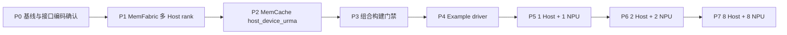
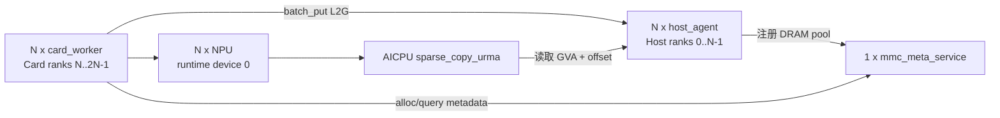

# MemCache + MemFabric 本地 DRAM 到 HBM Example 执行计划

## 1. 目标与执行边界

本文把 `docs/e2e_local_dram_memcache_deployment_and_validation_design.md` 拆成可逐项评审、实施和验收的任务。

执行顺序固定为两大步：

1. 先完成 MemFabric 与 MemCache 的最小库改动，使 `host_device_urma` 和多 Host validation rank 可用。
2. 库改动通过构建和单元测试后，再实现最小 example，并按 1 Host + 1 NPU、2 Host + 2 NPU、8 Host + 8 NPU 逐级实机验证。

本计划不实现 vLLM connector，不实现 miss 判断、跨 block 拼接、多 replica 或跨 Host 分片。Example 只验证真实接口链路：

```text
batch_put_from_layers
  -> MetaService 分配 Host DRAM GVA
  -> batch_get_key_info
  -> GVA + 合法随机 offset
  -> sparse_copy_urma
  -> HBM 数据比较
```

本轮只落盘执行计划，不修改源码、不执行实机验证、不提交或推送实现代码。

## 2. 已确认基线与一个编码修正

| 仓库 | 执行基线 | 用途 |
|---|---|---|
| MemCache | `C:\code\memcache`，`feat/aicpu-urma-design`，设计基线 `481c3a47` | MetaService、LocalService、Python API、example |
| MemFabric | `C:\code\memfabric_hybrid`，`feat/aicpu-urma-design-local-dram`，`c42438e5` | Host DRAM validation、GVA route、AICPU sparse copy |
| vLLM Ascend | `C:\code\vllm-ascend`，`3a97fe2ad` | 仅参考 batch put 输入形态，不修改、不运行 |
| vLLM | `C:\code\vllm`，`68b4a1d58` | 本 example 不依赖 |

实现前必须以实际工作区 HEAD 再记录一次基线，不能假定执行时仍是上表提交。

### 2.1 `HOST_DEVICE_URMA` 的两层枚举不可混用

源码确认存在两套不同编码：

| 层级 | 符号 | 正确值 | 证据 |
|---|---|---:|---|
| SMEM 公共 API | `SMEMB_DATA_OP_HOST_DEVICE_URMA` | `1U << 8` | MemFabric `src/smem/include/host/smem_bm_def.h:64` |
| HYBM 内部 API | `HYBM_DOP_TYPE_HOST_DEVICE_URMA` | `1U << 10` | MemFabric `src/hybm/include/hybm_def.h:90` |

MemCache 的 `smem_bm_data_op_type` 是 SMEM 公共 API 的副本，因此 M2 必须使用 `1U << 8`。MemFabric 已在 `src/smem/csrc/smem_bm/smem_hybm_helper.h:56` 完成 SMEM `1U << 8` 到 HYBM `1U << 10` 的转换，不能在 MemCache 中提前使用内部值。

## 3. 总体里程碑



每个阶段必须满足退出条件后才能进入下一阶段。P1 和 P2 可以分别形成独立提交，但依赖顺序不能交换：MemFabric 先产生可引用提交，MemCache 再更新依赖和接口。

## 4. 第一大步：完成 MemFabric 与 MemCache 改动

### 4.1 P0：准备与冻结改动范围

执行动作：

1. 在两个仓库分别记录 `git status --short --branch`、`git rev-parse HEAD` 和分支名。
2. 保留所有已有用户改动；如果目标文件已有未提交修改，先停止并确认重叠内容。
3. MemFabric 从 `c42438e5` 所在分支创建实现分支；MemCache 从当前设计分支创建实现分支。
4. 确认 MemCache 构建所用 MemFabric include、library 和 gitlink 来自同一个提交。
5. 将 `SMEMB_DATA_OP_HOST_DEVICE_URMA == 1U << 8` 作为组合构建前置检查。

退出条件：两个仓库工作区状态、起始提交和依赖来源都有记录，且没有需要覆盖的用户修改。

### 4.2 P1：MemFabric 支持多个 validation Host rank

#### 4.2.1 必须修改

| 文件/符号 | 最小改动 | 必要性 |
|---|---|---|
| `src/hybm/csrc/common/local_dram_validation_role.h:30-56`，`GetLocalDramValidationRole` | 把 `role != "host" || rankId != 0U` 改为只拒绝非 `host` role；保留 protocol 和 Host EID 判断 | 现代码只允许 rank 0 成为 Host。2+2 的 Host rank 1 和 8+8 的 Host rank 1～7 都会被拒绝 |
| `test/ut/testcase/hybm/common/local_dram_validation_role_test.cpp`（新增） | 直接覆盖 rank 0 和非零 rank 的 Host role；测试文件在 include 前定义 `MF_LOCAL_DRAM_VALIDATION` | 该 helper 受编译宏保护，现有普通 UT 没有直接覆盖多 rank 行为 |

测试至少覆盖：

1. 未设置 validation role 时，任意 rank 返回 `DEVICE`。
2. `role=host`、正确 protocol、有效 `MF_HOST_URMA_EID` 时，rank 0 返回 `HOST`。
3. 相同条件下，rank 1 和 rank 7 也返回 `HOST`；这是本改动的核心断言。
4. 非 `host` role 返回 `INVALID`。
5. Host role 配错误 protocol 返回 `INVALID`。
6. Host role 未提供 EID 返回 `INVALID`。

测试环境变量在每个用例结束后恢复，避免影响同一测试进程中的其他用例。这里的清理只为保证 UT 相互独立，不扩展运行时逻辑。

#### 4.2.2 明确不修改

- 不改 route 发布、GVA 编码和 transport manager。
- 不改 `HOST_DEVICE_URMA` protocol 判断。
- 不改 `MF_HOST_URMA_EID` 的读取方式。
- 不把 local validation 变成正式远端 Host 部署模式。

#### 4.2.3 本地验证命令

```bash
bash script/run_ut.sh --fast LocalDramValidationRole
bash script/run_ut.sh --fast
bash script/build_and_pack_run.sh \
  --build_mode DEBUG \
  --build_local_dram_validation ON \
  --xpu_type NPU \
  --build_tool cmake
```

如果 `run_ut.sh` 的名称过滤按套件名而不是文件名匹配，实现时用新增的实际 GTest suite 名替换 `LocalDramValidationRole`。

P1 退出条件：

- 多 rank role UT 通过；
- MemFabric fast UT 通过；
- 打开 `BUILD_LOCAL_DRAM_VALIDATION=ON` 的 NPU debug build 成功；
- 产出一个可供 MemCache 引用的确定提交，记作 `<MF_MULTI_HOST_COMMIT>`。

建议提交边界：一个 MemFabric 提交，只包含 helper 条件和对应 UT。

### 4.3 P2：MemCache 接受 `host_device_urma`

#### 4.3.1 功能必改

| 文件/符号 | 最小改动 | 必要性 |
|---|---|---|
| `src/memcache/csrc/under_api/mf_smem/smem_bm_def.h:55-64`，`smem_bm_data_op_type` | 在 `DEVICE_UBOE` 后增加 `SMEMB_DATA_OP_HOST_DEVICE_URMA = 1U << 8` | MemCache 当前 vendored SMEM 声明缺少目标公共枚举，无法把配置传给 MemFabric |
| `src/memcache/csrc/config/mmc_configuration.h:51-52`，`LOCAL_SERVER_PROTOCAL_ENUM_STR` | 增加字符串 `host_device_urma` | 否则 LocalService 配置校验直接拒绝目标 protocol |
| `src/memcache/csrc/common/mmc_smem_bm_helper.h:23-50`，`TransSmemBmDataOpType` | 增加字符串到 `SMEMB_DATA_OP_HOST_DEVICE_URMA` 的映射 | 否则创建 BM 时会得到 `SMEMB_DATA_OP_BUTT` |
| `test/ut/testcase/memcache/csrc/config/test_mmc_configuration.cpp:129`，`ValidateLocalServiceConfigTest` | 增加协议校验和 helper 映射断言 | 防止字符串已放行但转换仍缺失，或编码写错 |

新增测试必须明确断言：

```cpp
MmcSmemBmHelper::TransSmemBmDataOpType("host_device_urma")
    == SMEMB_DATA_OP_HOST_DEVICE_URMA;
static_cast<uint32_t>(SMEMB_DATA_OP_HOST_DEVICE_URMA) == (1U << 8);
```

池大小继续使用已对齐的 1 GiB，不修改 `ValidateLocalServiceConfig` 的容量对齐逻辑。

#### 4.3.2 依赖必改

| 位置 | 改动 | 必要性 |
|---|---|---|
| MemCache `3rdparty/memfabric_hybrid` gitlink | 更新到 `<MF_MULTI_HOST_COMMIT>` | 保证构建时 header、library 与本次多 Host 修复一致，避免只在外部目录偶然可运行 |

执行依赖更新时先确认子模块工作区干净，再 checkout 确定提交并只暂存 gitlink。不能只更新本机 `LD_LIBRARY_PATH` 而让仓库继续指向旧版。

#### 4.3.3 仓库一致性改动

以下内容不增加运行逻辑，但协议作为公开配置值后需要同步：

| 文件 | 改动 |
|---|---|
| `config/mmc-local.conf` | 在 protocol 注释和 1 GiB 对齐列表中加入 `host_device_urma` |
| `docs/memcache_config.md` | 在 `ock.mmc.local_service.protocol` 的合法值和对齐说明中加入该协议 |
| `docs/memcache_c++_api.md` | 在 C++ 配置协议列表中加入该协议 |
| `docs/memcache_python_api.md` | 在 Python 配置协议列表中加入该协议 |

这些文件与功能改动放在同一 MemCache 提交中，便于逐条审视；不修改 MetaService、batch put、KeyInfo 或 Python binding。

#### 4.3.4 本地验证命令

```bash
bash script/run_ut.sh mmc_configuration
bash script/run_ut.sh
bash script/build_and_pack_run.sh --build_mode DEBUG --incremental
bash script/ci-pre-commit-pr.sh
```

若完整 UT 因本机缺少 NPU/MetaService 环境不能执行，应保留已完成的配置 UT 和构建结果，并把未执行项明确标为“待 NPU 环境执行”，不能写成通过。

P2 退出条件：

- 配置接受 `host_device_urma`；
- helper 返回 SMEM `1U << 8`；
- MemCache 指向 `<MF_MULTI_HOST_COMMIT>`；
- 配置 UT、可执行的全量 UT、debug build 和增量检查有明确结果。

建议提交边界：一个 MemCache 库支持提交，包含枚举、配置、helper、UT、配置文档和 MemFabric gitlink；尚不包含 example。

### 4.4 P3：MemCache + MemFabric 组合构建门禁

组合构建必须使用同一个 MemFabric 提交的 headers、shared libraries 和 Python package：

1. 从 `<MF_MULTI_HOST_COMMIT>` 以 local validation ON 构建 MemFabric。
2. 安装到一个明确的测试前缀，记录 `MEMFABRIC_HYBRID_HOME_PATH`。
3. 让 MemCache 子模块和构建环境都指向同一提交/安装前缀。
4. 构建并安装 MemCache，记录 `MEMCACHE_HYBRID_HOME_PATH`。
5. 检查 `libmf_memcache.so` 的动态依赖解析到本次 MemFabric 产物。
6. 执行 Python import smoke：`memcache_hybrid`、`torch_npu`、`memfabric_hybrid.mf_acc_offload` 均可导入。
7. 用一份最小 LocalService 配置确认 `host_device_urma` 不再在配置校验阶段失败；此时不要求启动完整 world。

P3 退出条件：库接口、动态库和 Python module 均来自同一组构建产物，才允许开始写 example。

## 5. 第二大步：分步骤实现最小 example

### 5.1 P4：文件范围和进程关系

默认只新增设计文档约定的四个文件：

| 文件 | 实现职责 |
|---|---|
| `example/e2e_local_dram_memcache/README.md` | 构建前置条件、EID 配置、1/2/8 三种运行命令和 PASS 判据 |
| `example/e2e_local_dram_memcache/host_agent.cpp` | 解析少量 CLI，构造 `mmc_local_service_config_t`，启动/停止 Host LocalService |
| `example/e2e_local_dram_memcache/card_worker.py` | 在单 NPU 进程中执行 put、key-info、随机 offset、sparse copy 和 compare |
| `example/e2e_local_dram_memcache/run_e2e.sh` | 编译 Host agent、生成配置、按固定顺序启动 Meta/Host/card 并汇总结果 |

第一版不修改根 CMake。`run_e2e.sh` 使用 `${CXX:-g++}` 把 `host_agent.cpp` 编译到运行目录，include 和 `libmf_memcache.so` 必须从 `MEMCACHE_HYBRID_HOME_PATH` 的实际安装目录解析；找不到时在启动任何进程前退出。若评审认为仓库 example 必须统一纳入 CMake，再单独增加构建接入任务，不与功能 driver 混在第一版。



其中 `N` 依次取 1、2、8，`worldSize=2*N`。

### 5.2 P4.1：实现 `host_agent.cpp`

CLI 固定为：

```text
--slot <0..N-1>
--world-size <2|4|16>
--meta-url <url>
--store-url <url>
--hcom-url <url>
--dram-size <bytes>
--max-dram-size <bytes>
--max-hbm-size <bytes>
```

实现顺序：

1. 解析 CLI，并把 size 全部转为无符号字节数；runner 固定传 `1073741824`，C++ 不需要实现 `1GB` 文本解析。
2. 构造零初始化的 `mmc_local_service_config_t`。
3. 填写 `discoveryURL`、`worldSize`、`bmIpPort`、`bmHcomUrl`、`backendId=host-${slot}`、`createId=0`、`deviceId=0`。
4. 填写 `dataOpType=host_device_urma`、DRAM=1 GiB、HBM=0、max DRAM/HBM=1 GiB、`storageEnabled=false`。
5. 调用真实 `mmcs_local_service_start`；成功后只打印一行 `HOST_READY slot=<i>` 并保持进程存活。
6. 收到 runner 的正常终止信号后调用 `mmcs_local_service_stop`。

不在 Host agent 中创建 MemCache client，不分配测试 key，不直接调用 MemFabric API。

代码检查：

- 所有字符数组复制使用仓库已有的长度检查/安全复制风格。
- `worldSize`、slot 和字节数的解析错误在调用 LocalService 前报告。
- 只保留运行 example 所需日志，不增加通用 daemon 框架。

### 5.3 P4.2：实现 `card_worker.py`

CLI 固定为：

```text
--slot
--device-id
--expected-rank
--preferred-host-rank
--key-count
--layer-count
--layer-bytes
--copy-bytes
--random-seed
```

第一版参数值固定为 4 keys、4 layers、4096 bytes/layer、1024 bytes/copy，CLI 只为 1/2/8 共用同一个 driver。

实现步骤：

1. 导入 `torch`、`torch_npu`、MemCache Python API 和 `mf_acc_offload`。
2. `DistributedObjectStore.init(device_id=0)`，由配置启动本进程的 card LocalService 和 client。
3. 为每个 key 创建四个 NPU `uint8` tensor；字节值由 `slot/key/layer` 唯一决定。
4. 同步 NPU，组装每个 key 的 layer 地址列表和 size 列表。
5. 设置 `replicaNum=1` 和 `preferredLocalServiceIDs=[preferred_host_rank]`。
6. 调用真实 `batch_put_from_layers(..., L2G, replica)`，要求四个返回值均为 0。
7. 调用真实 `batch_get_key_info(keys)`，逐项检查：size=16384、介质为 DRAM、location 为目标 Host rank、GVA 非零。
8. 使用 `random.Random(random_seed + slot)` 为每个 key 生成 `1 <= offset <= objectBytes-copyBytes` 的非零随机偏移。
9. 构造 NPU `int64` tensor：`src=GVA+offset`、`dst=HBM data_ptr`、`len=1024`。
10. 调用真实 `mf_acc_offload.sparse_copy_urma(src, dst, len, key_count, device)`。
11. `torch.npu.synchronize()` 后，把目标 HBM tensor 与原对象 `[offset:offset+1024]` 比较。
12. 删除本 worker 创建的 keys，关闭 store，打印唯一终态 `slot=<i> PASS`。

这里不实现 miss。随机 offset 的唯一目的，是证明 `batch_get_key_info` 给出的 GVA 能进行地址运算并被 AICPU sparse copy 使用。

### 5.4 P4.3：实现 `run_e2e.sh`

脚本输入：

```bash
bash example/e2e_local_dram_memcache/run_e2e.sh --count 1
bash example/e2e_local_dram_memcache/run_e2e.sh --count 2
bash example/e2e_local_dram_memcache/run_e2e.sh --count 8
```

只接受 `1|2|8`。脚本按下面顺序执行：

1. source CANN、MemFabric、MemCache 安装环境和 `run_e2e.env`。
2. 检查 count 对应的 `HOST_EID_i`、`DEVICE_EID_i`，以及可见 NPU 数量。
3. 计算 `WORLD_SIZE=2*count`，创建本次独立运行目录。
4. 编译 `host_agent.cpp` 到运行目录。
5. 生成一份 `mmc-meta.conf` 和 count 份 `card-${slot}.conf`。
6. 启动一个 MetaService；其 URL 固定为 5000/6000/8000，HCOM URL 固定为 7000。
7. 依次启动 Host agents，保证它们先加入 world 并取得 ranks `0..count-1`。
8. 启动 card workers，分别设置 `ASCEND_RT_VISIBLE_DEVICES=${slot}`，进程内 `device-id=0`，期望 ranks `count..2*count-1`。
9. 等待所有 card workers，统计 `slot=i PASS`。
10. 正常停止 Host agents 和 MetaService，返回 0；任一 worker 未 PASS 则返回非零。

runner 生成的参数遵循：

| count | world size | Host ranks | card ranks | card 到 Host |
|---:|---:|---|---|---|
| 1 | 2 | 0 | 1 | card 0 -> Host 0 |
| 2 | 4 | 0,1 | 2,3 | card i -> Host i |
| 8 | 16 | 0..7 | 8..15 | card i -> Host i |

### 5.5 P4.4：实现 `README.md`

README 只保留可以复制执行的内容：

1. 两个仓库要求的提交和 local validation build 选项。
2. CANN/MemFabric/MemCache 环境加载顺序。
3. `run_e2e.env` 中 EID 变量模板。
4. `--count 1`、`--count 2`、`--count 8` 三条命令。
5. 固定 pool/key/layer/copy 参数表。
6. 正常输出示例和 PASS 判定。

不重复设计背景，不加入 vLLM 使用说明。

P4 退出条件：四个文件完成静态检查；shell 能生成 count=1/2/8 的正确 world/rank/config，但尚不把“未上机”写成通过。

## 6. 分级实机验证

### 6.1 P5：1 Host + 1 NPU

运行：

```bash
bash example/e2e_local_dram_memcache/run_e2e.sh --count 1
```

逐项验收：

- world size 为 2；Host rank=0，card rank=1。
- Host rank 0 注册 1 GiB DRAM pool。
- card 的四个 `batch_put_from_layers` 返回值为 0。
- 四个 KeyInfo 均为 Host rank 0、DRAM、16384 bytes、非零 GVA。
- 四个 offset 均非零且 `offset+1024<=16384`。
- `sparse_copy_urma(listNum=4)` 返回 0。
- 四个 HBM 片段逐字节相同，最终输出 `slot=0 PASS`。

只有本阶段通过后才进入 2+2。

### 6.2 P6：2 Host + 2 NPU

运行：

```bash
bash example/e2e_local_dram_memcache/run_e2e.sh --count 2
```

逐项验收：

- world size 为 4；Host ranks=0,1，card ranks=2,3。
- slot 0 的四个 key 位于 Host rank 0；slot 1 的四个 key 位于 Host rank 1。
- 两个 worker 都使用各自固定 seed 产生的合法非零 offset。
- 两次 `sparse_copy_urma(listNum=4)` 均返回 0。
- 输出同时包含 `slot=0 PASS` 和 `slot=1 PASS`。

本阶段专门验证 M3 的“非零 Host rank 可初始化”以及两条独立 GVA route；环境只有两张 NPU 时即可完成。

### 6.3 P7：8 Host + 8 NPU

运行：

```bash
bash example/e2e_local_dram_memcache/run_e2e.sh --count 8
```

逐项验收：

- world size 为 16；Host ranks=0..7，card ranks=8..15。
- 每个 `card slot i` 的四个 KeyInfo 都指向 `Host rank i`。
- 8 个 worker 共完成 32 个带非零随机 offset 的 GVA 片段复制。
- 32 个 HBM 片段全部逐字节相同。
- 输出包含且只包含八个 worker 的 PASS 终态。

P7 通过即完成本 example 的目标，不继续自动接入 vLLM。

## 7. 实现提交拆分与评审顺序

建议按以下顺序形成三个本地提交，逐个给用户审视；未经用户明确要求不推送、不合并：

| 顺序 | 仓库 | 提交内容 | 不应混入 |
|---:|---|---|---|
| 1 | MemFabric | 多 Host rank 条件 + 专项 UT | route、AICPU、正式远端模式改造 |
| 2 | MemCache | SMEM 枚举、配置字符串、helper、UT、协议文档、MemFabric gitlink | example、Meta/KeyInfo/batch put 改造 |
| 3 | MemCache | 四个 example 文件 | vLLM、通用部署框架、额外协议逻辑 |

每个提交前都先展示 `git diff --check`、目标文件 diff 和测试结果；不要用一个提交跨两个仓库。

## 8. 文件级执行清单

### 8.1 MemFabric

- [ ] 修改 `src/hybm/csrc/common/local_dram_validation_role.h`。
- [ ] 新增 `test/ut/testcase/hybm/common/local_dram_validation_role_test.cpp`。
- [ ] 运行专项 UT、fast UT 和 local validation debug build。
- [ ] 记录 `<MF_MULTI_HOST_COMMIT>`。

### 8.2 MemCache 库

- [ ] 增加 SMEM 公共枚举 `1U << 8`。
- [ ] 增加配置字符串 `host_device_urma`。
- [ ] 增加 helper 映射。
- [ ] 增加配置/编码 UT。
- [ ] 同步四处协议配置文档/注释。
- [ ] 更新 MemFabric gitlink 到 `<MF_MULTI_HOST_COMMIT>`。
- [ ] 完成 MemCache 构建、UT 和增量检查。
- [ ] 完成两个库的组合构建/import 门禁。

### 8.3 Example

- [ ] 新增 `README.md`。
- [ ] 新增 `host_agent.cpp`。
- [ ] 新增 `card_worker.py`。
- [ ] 新增 `run_e2e.sh`。
- [ ] 检查 count=1/2/8 生成的 world/rank/card 配置。
- [ ] 依次完成 1+1、2+2、8+8 实机验证。

## 9. 开始实机执行前需要提供的环境值

以下数值不从代码猜测，由实际机器填写：

- `HOST_EID_0..7` 和 `DEVICE_EID_0..7`；1+1 只需索引 0，2+2 只需索引 0、1。
- CANN 环境脚本路径。
- MemFabric local-validation 安装路径。
- MemCache 安装路径。
- 1、2 或 8 张可用物理 NPU 对应的可见设备编号。

端口默认使用设计文档中的 5000、6000、7000、8000。如果目标机器这些端口已被占用，运行前统一替换四个 URL；Meta、Host 和 card 配置必须使用同一组值。

## 10. 最终完成定义

只有同时满足下面条件，才把任务标记为完成：

1. MemFabric 非零 Host rank 的 validation role 有代码和 UT 证据。
2. MemCache 能从配置字符串得到 SMEM `HOST_DEVICE_URMA (1U << 8)`，且依赖指向同一 MemFabric 提交。
3. Example 未修改 MetaService、KeyInfo、batch put、MemFabric route 或 AICPU kernel。
4. 同一套 driver 已按顺序通过 1+1、2+2、8+8。
5. 每个 worker 都使用 `batch_get_key_info` 返回的真实 GVA，加合法非零随机 offset 后调用真实 `sparse_copy_urma`，并通过 HBM 数据比较。

